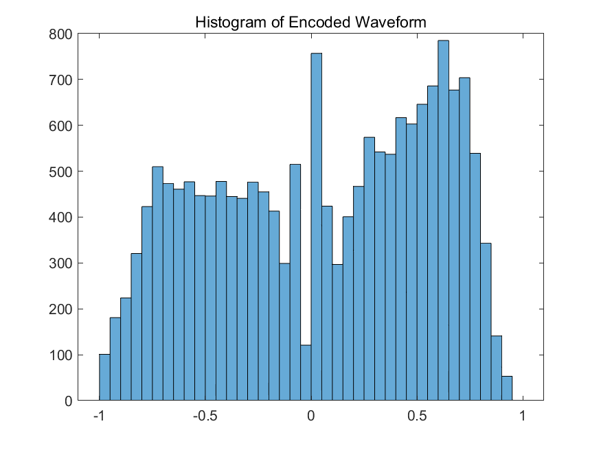

# **Lab10 Report**
### *李梓源     SID:12211225*
### *李沅朔     SID:12210301*

---
## Introduction
This lab course mainly focus on $\mu$-law quantization and adaptive quantization, which automatically fits the smaller signal amplitude. In this lab, we also learns how to encode a speech using $\mu$-law from bottom to the end and do several comparision between $\mu$-law quantiziation and static quantization, which shows several advantages of encoding the speech siganal adaptively.

---

## Problem 1

### Problem description

1. Plot the output waveform y[n] of the μ - law compressor and plot a histogram of the output samples.

2. Write an m - file for the inverse of the μ - law compressor, named mulawinv(y, mu). The function should follow a specific calling sequence and parameter definition. Test the inverse system by applying it to the output of mulaw() without quantization.

3. Compute and plot the first 8000 samples of the resulting quantization error, plot a histogram of the quantization error amplitudes, and plot the power spectrums of the resulting quantization errors.

### Solutions and process   

1. Use the given MATLAB function `mulaw()` to do the μ compression
2. Follow the steps shown in the figure, first calculate the amplitude, and then recover the sign by multplying `sign(y)`

3. First calculate yhat using MATLAB function `fxquant()`, then calculate the error spctrum using `pspect()` 


   

### Key code segment

1. 
```matlab
x = (-1:0.001:1);
figure
plot(mulaw(x,1), 'LineWidth',1), hold on;
plot(mulaw(x,20), 'LineWidth',1), hold on;
plot(mulaw(x,50), 'LineWidth',1), hold on;
plot(mulaw(x,100), 'LineWidth',1), hold on;
plot(mulaw(x,225), 'LineWidth',1), hold on;
plot(mulaw(x,500), 'LineWidth',1), hold off;
title('Waveform After Encoding')
legend('1', '20', '50', '100', '225', '500');
```

2. Derive function `my_mulawinv()`
```matlab
[y, fs] = audioread('s5.wav');
y = y(1300:18800);
figure
subplot(211)
plot(y), title('Original Wavform')
subplot(212)
plot(mulaw(y, 225)), title('Encoded Waveform')
saveas(gcf, "D:/作业提交/大三 下/语音信号处理/lab10/P1_b_1.png", 'png')
% 直方图
figure
histogram(mulaw(y, 225))
title('Histogram of Encoded Waveform')
saveas(gcf, "D:/作业提交/大三 下/语音信号处理/lab10/P1_b_2.png", 'png')

function x = my_mulawinv(y, mu)
    % 计算幅度部分
    abs_x = ( (1 + mu) .^ abs(y) - 1 ) / mu;
    % 恢复符号
    x = abs_x .* sign(y);
end
```

3. Plotting the error power spectrum
```matlab
yh_4 = fxquant(mulaw(x, 225), 4, 'round', 'sat');
yh_8 = fxquant(mulaw(x, 225), 8, 'round', 'sat');
yh_10 = fxquant(mulaw(x, 225), 10, 'round', 'sat');
yh_6 = fxquant(mulaw(x, 225), 6, 'round', 'sat');
e_4 = mulawinv(yh_4, 255) - x;
e_6 = mulawinv(yh_6, 255) - x;
e_8 = mulawinv(yh_8, 255) - x;
e_10 = mulawinv(yh_10, 255) - x;
e_4 = e_4(1:8000);
e_6 = e_6(1:8000);
e_8 = e_8(1:8000);
e_10 = e_10(1:8000);
% histogram
figure
subplot(221), histogram(e_4), title('Quantization Error with 4 bits')
subplot(222), histogram(e_6), title('Quantization Error with 6 bits')
subplot(223), histogram(e_8), title('Quantization Error with 8 bits')
subplot(224), histogram(e_10), title('Quantization Error with 10 bits')
saveas(gcf, "D:/作业提交/大三 下/语音信号处理/lab10/P1_d_1.png", 'png')

% Power Spectrum
win_len = 512;
[p_4, f4] = pspect(e_4, fs, win_len, win_len);
[p_6, f6] = pspect(e_6, fs, win_len, win_len);
[p_8, f8] = pspect(e_8, fs, win_len, win_len);
[p_10, f10] = pspect(e_10, fs, win_len, win_len);
figure
plot(f4, p_4, 'LineWidth',1), hold on;
plot(f6, p_6, 'LineWidth',1), hold on;
plot(f8, p_8, 'LineWidth',1), hold on;
plot(f10, p_10, 'LineWidth',1), hold off;
xlabel('Frequency (HZ)');
ylabel('Power Spectrum (dB)');
legend('4-bit', '6-bit', '8-bit', '10-bit');
saveas(gcf, "D:/作业提交/大三 下/语音信号处理/lab10/P1_d_2.png", 'png')
```

### Result and Analysis

1. Question A


2. Question B


As we can see in the result, after encoding, the samll amplitude are increased, which provide convenience and accuracy for the following encoding and decoding.

3. Question C
```matlab
v = my_mulawinv(mulaw(y, 225), 225);
mean(v-y)
```
In the code, we use the above method to derive the gap between v and original siganl y. The result is 4.62*10^-19, which is samll enough to prove the effiency of `my_mulawinv()`

4. Question D
We tested more situations aside form 6-bits(4, 8, 10 bits are all tested), and we can see that as the bit number increase, the error decrease evidently.


---

## Problem 2
### Problem description 

1. Write function to compute SNR,output SNR in dB. Use it to compute SNRs for 8 - and 9 - bit uniform quantization of a s5.wav speech segment

2. Vary the input speech signal level and write a program to plot measured SNR for all 13 cases. Additionally, use differnet stastic quantization value and μ quantization value and compare its diffences. 


### Solution and process

1. Derive a MATLAB function `SNR` to calculate the SNR for a uniform B-bit quantizer. The mathmatical description is shown bellow:


2. Compare the quantization result for differnt parameters and both stastic quantization and μ-bit quantization. To be concise, in the μ-bit quantization, first compress the original signal, then do a uniform quantization, thirdly, expand the μ-bit encoded signal and finally calacualte the SNR.


### Key code segment

1. Derive the SNR function based on the formula above
```matlab
[y, fs] = audioread('s5.wav');
% mu-量化
y_new = mulaw(y, 225);
% 均匀量化
yh_8 = fxquant(mulaw(y, 225), 8, 'round', 'sat');
yh_9 = fxquant(mulaw(y, 225), 9, 'round', 'sat');
yh_10 = fxquant(mulaw(y, 225), 10, 'round', 'sat');
yh_11 = fxquant(mulaw(y, 225), 11, 'round', 'sat');
yh_12 = fxquant(mulaw(y, 225), 12, 'round', 'sat');
% s = y - yh_8
[snr_8, e_8] = SNR(yh_8, y_new);
[snr_9, e_9] = SNR(yh_9, y_new);
[snr_10, e_10] = SNR(yh_10, y_new);
[snr_11, e_11] = SNR(yh_11, y_new);
[snr_12, e_12] = SNR(yh_12, y_new);
bit = [8,9,10,11,12];
snr = [snr_8, snr_9, snr_10, snr_11, snr_12];
figure
stem(bit, snr), xlabel('Bits Number'), ylabel('SNR (dB)'), title('SNR for Uniform Quatization')
grid on

function y = mulaw(x, mu)
    y = sign(x) .* log(1 + mu * abs(x)) / log(1 + mu);
end

function [snr, e] = SNR(xh, x)
    L = length(x);
    sum_sig = 0;
    sum_err = 0;
    for i=1:L
        sum_sig = sum_sig + x(i).^2;   % 分号！！！
        sum_err = sum_err + (x(i)-xh(i)).^2;   % 分号！！！
    end
    sum_sig
    sum_err
    snr = 10*log10(sum_sig/sum_err)
    e = mulaw(xh, 225) - x;
%     mean(e)
end
```

2.  Compare all situations in one figure.
```matlab
% 参数设置
factors = 2.^(0:-1:-12); 
mu_values = [100, 255, 500];
bits_uniform = 6:10;

% 初始化存储矩阵
snr_uniform = zeros(length(factors), length(bits_uniform));
snr_mulaw = zeros(length(factors), length(mu_values));
inv_sigma_x = zeros(length(factors), 1);

% 计算不同幅度下的SNR
for i = 1:length(factors)
    x_scaled = x * factors(i);
    sigma_x = std(x_scaled);
    inv_sigma_x(i) = 1 / sigma_x;
    
    % 均匀量化
    for j = 1:length(bits_uniform)
        x_quant = fxquant(x_scaled, bits_uniform(j), 'round', 'sat');
        snr_uniform(i,j) = 10 * log10( sum(x_scaled.^2) / sum((x_scaled - x_quant).^2) );
    end
    
    % μ-law量化 (6 bits)
    for k = 1:length(mu_values)
        % μ-law压缩
        y = mulaw(x_scaled, mu_values(k));
        % 均匀量化（6 bits）
        y_quant = fxquant(y, 6, 'round', 'sat');
        % μ-law扩展
        x_recon = mulawinv(y_quant, mu_values(k));
        % 计算 SNR (dB)
        snr_mulaw(i,k) = 10 * log10( sum(x_scaled.^2) / sum((x_scaled - x_recon).^2) );
    end
end

figure;
semilogx(inv_sigma_x, snr_uniform, 'LineWidth', 1.5); hold on;
semilogx(inv_sigma_x, snr_mulaw, '--', 'LineWidth', 2);
xlabel('1/\sigma_x'); ylabel('SNR (dB)');
title('SNR vs 1/\sigma_x for Uniform and \mu-law Quantization');
grid on;

legend_labels = [...
    arrayfun(@(b) sprintf('%dbit', b), bits_uniform, 'UniformOutput', false), ...
    arrayfun(@(mu) sprintf('\\mu-law (\\mu=%d)', mu), mu_values, 'UniformOutput', false) ...
];
legend(legend_labels, 'Location', 'southwest');
```


### Result and Analysis

1. As shown in the result, whenever one bit is added, the SNR increases approximatlly 6dB, which fit the tone. 

2.  For μ-law quantization:
- When $1/\sigma_x$ varies  the SNR remains relatively stable.
- Optimal performance is achieved at μ=255 (standard parameter for telephone speech coding).
3. For Uniform quantization:
- The SNR degrades sharply as the signal amplitude decreases (due to higher quantization errors for small signals).
-  Approximately ~12 bits are required to match the dynamic range of 6-bit μ-law quantization.

    
---
## Problem 3
- **Problem description:**
This task requires us to compute the complex and real cepstra for a section of voiced and a section of unvoiced speech. We are required to plot the signal, the log magnitude spectrum, the real cepstrum, and a low quefrency liftered log magnitude spectrum. 

- **Key code segment:**

> ```matlab
> [aud, fs] = audioread("test_16k.wav");
> 
> t = ( 1:400 )' / fs;
> voiced = aud(13000:13399);
> unvoiced = aud(3400:3799);
> 
> hamm = hamming(400); % Hamming window of length 400
> voiced = voiced .* hamm;
> unvoiced = unvoiced .* hamm;
> 
> voiced_padd = [voiced; zeros(512-length(voiced), 1)];
> unvoiced_padd = [unvoiced; zeros(512-length(unvoiced), 1)];
> 
> voiced_Spec = fft(voiced_padd, 512); % FFT of voiced signal
> unvoiced_Spec = fft(unvoiced_padd, 512); % FFT of unvoiced signal
> 
> voiced_Spec = log(abs(voiced_Spec)); % Logarithm of the magnitude spectrum
> unvoiced_Spec = log(abs(unvoiced_Spec)); % Logarithm of the magnitude spectrum
> 
> [voiced_ccep, voiced_rcep] = Cepstrum(voiced_padd, 512); % 512 is the closese 2^n to 400
> [unvoiced_ccep, unvoiced_rcep] = Cepstrum(unvoiced_padd, 512); % 512 is the closese 2^n to 400
> 
> ```
>
> We select the audio segments as specified in the pdf, zero padds the signals to nearest 2^n and calculates the log spectrum by using fft. The real and complex cepstrum are calculated by reusing the Cepstrum function we wrote earlier. 
>
> ```matlab
> cutoff = 30; % cut-off quefrency
> lifter = [ones(cutoff,1); zeros(512-cutoff,1)]; 
> 
> voiced_liftered = voiced_rcep .* lifter; % Liftered cepstrum of voiced signal
> unvoiced_liftered = unvoiced_rcep .* lifter; % Liftered cepstrum of unvoiced signal
> 
> voiced_liftered_spectrum = abs(fft(voiced_liftered, 512)); % Liftered cepstrum to spectrum of voiced signal
> unvoiced_liftered_spectrum = abs(fft(unvoiced_liftered, 512)); % Liftered cepstrum to spectrum of unvoiced signal
> ```
>
> We used a rectangular window of length=30 on the cepstrum to do the liftering. After this, we convert it back into log magnitude spectrum by using fft and taking absolute value.
- **Results and Analysis:**


For the unvoiced signal, the spectrum is relatively "messy", not displaying dominant frequencies. The cepstrum is spiky and no prominent peaks can be seen. After liftering, the spectrum is smoothed, although there are still little observable regular shapes in its envelope. 

In the spectrum of the voiced signal, multiple peaks can be observed. They are likely the resonant peaks. In the cepstrum, at about 10 and 150 samples, peaks can be observed. After liftering, the consonant waves of the voiced signals are displayed more smoothly. 


---

## Conclusion

Yet to finish


