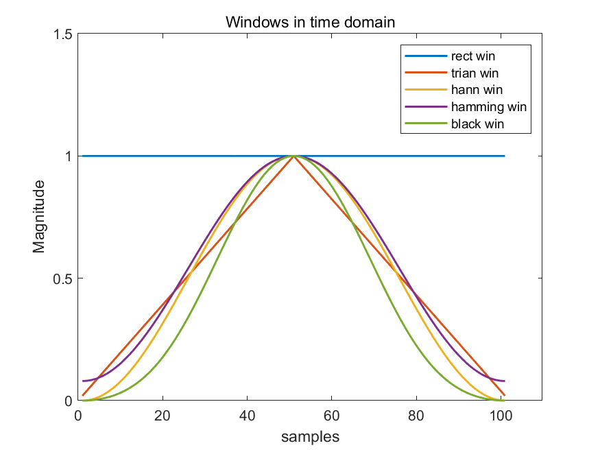
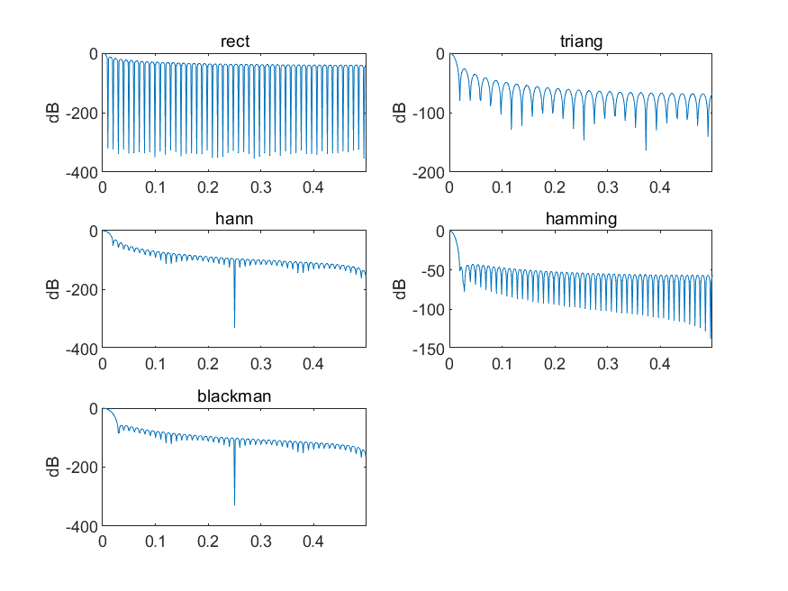
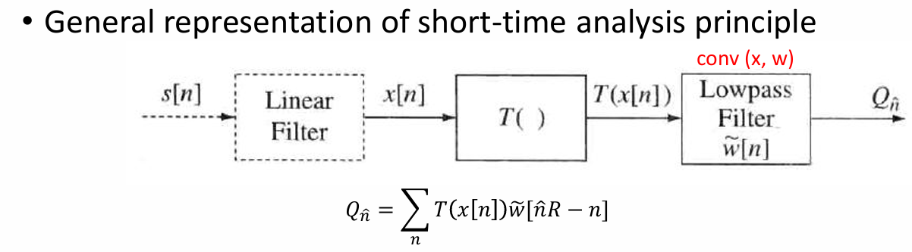
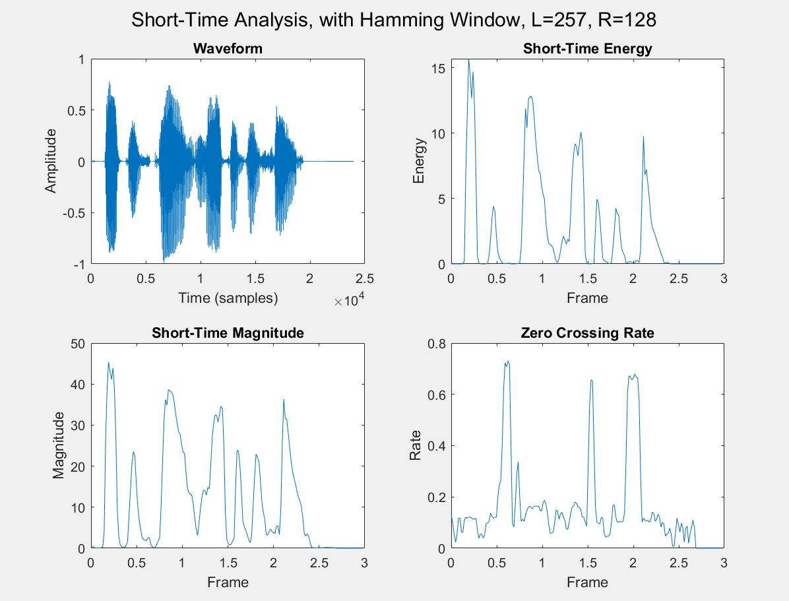
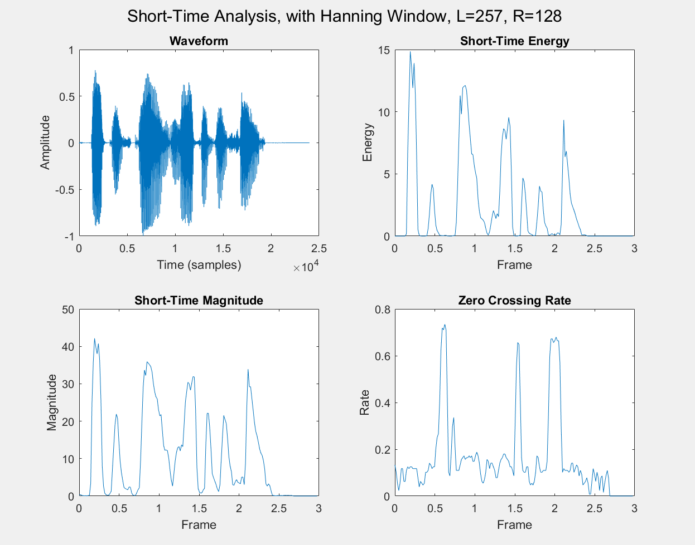
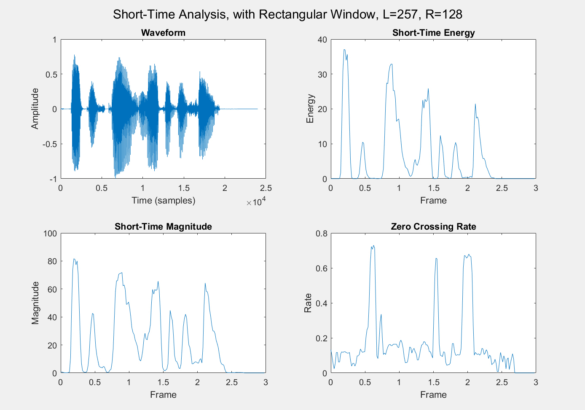
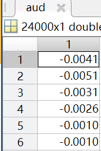
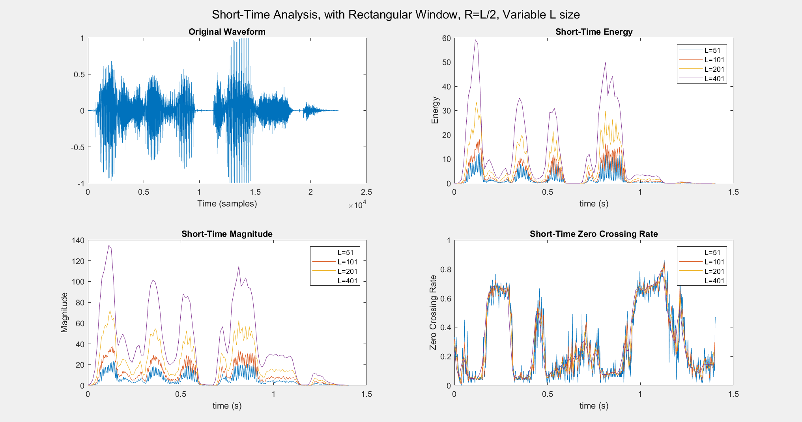

# **Lab5 Report**
### *李梓源     SID:12211225*
### *李沅朔     SID:12210301*

---
## Introduction
In this lab course, we mainly focus on the **short-time-analysis** of speech signal. Which include **short time energy**, **short time zero-crossing** and **short time magnitude**. Moreover, in order to derive a short time speech segment(frame), different **window functions** are tested and used. The result shows that imparity in window type and window parameters functions differently in short time analysis relsults. 

---

## Problem 1
- **Problem description:**

Plot and compare the time and frequency response of five different L-points windows. 
*hints:* L=101 and plot the log magitude response over a narrow band between 0 and 5*Fs/L. 

- **Solutions and process**

*1.* MATLAB have already provided a set of window functions, we only need to specify the length of the window.

*2.* Different to time plot, a zero-padding is needed to derive a more precise frequency response. In the code(which will be shown in the next block), we use `fft(w1, L*8)` instead of instead of `fft(w1, L)`. Moreover, the y-axis is converted to dB(log magnitude) and the a-axis is limited.

The narrower the main lobe width, the higher the frequency resolution. And the lower the sidelobe level, the less the spectral leakage. Take this as a standard of evaluation, 

- **Key code segment:**

*1.* A function `window_plot(L)` was witten. The function will make sure the input iwindow length is an odd number and plot the five windows in time domain.

```matlab
[y, fs] = audioread('s5.wav');
L = 256;   % 32ms per frame
win = hamming(L);   % 尚未补零
R = 128;   % 50% of window shift
short_time_analysis(y, fs, R, win, L);
```

*2.* As for frequency response, the first step is to do a zero-padding to make the result more precise. And in step two we convert the y-axis to dB(log magnitude) to better reveal the characteristics of the window.

```matlab

% log form
W1 = fft(w1, L*8);   % zero-padding
W2 = fft(w2, L*8);
W3 = fft(w3, L*8);
W4 = fft(w4, L*8);
W5 = fft(w5, L*8);

% magnitude only
W1_abs = abs(fftshift(W1));
W2_abs = abs(fftshift(W2));
W3_abs = abs(fftshift(W3));
W4_abs = abs(fftshift(W4));
W5_abs = abs(fftshift(W5));

f = (-L*4:L*4-1) ./ (L*8);

W1_db = 20*log10(W1_abs/max(W1_abs));
W2_db = 20*log10(W2_abs/max(W2_abs));
W3_db = 20*log10(W3_abs/max(W3_abs));
W4_db = 20*log10(W4_abs/max(W4_abs));
W5_db = 20*log10(W5_abs/max(W5_abs));

figure;

subplot(321)
plot(f, W1_db), ylabel('dB'), xlim([0, 0.5])
title('rect')
subplot(322)
plot(f, W2_db), ylabel('dB'), xlim([0, 0.5])
title('triang')
subplot(323)
plot(f, W3_db), ylabel('dB'), xlim([0, 0.5])
title('hann')
subplot(324)
plot(f, W4_db), ylabel('dB'), xlim([0, 0.5])
title('hamming')
subplot(325)
plot(f, W5_db)
title('blackman'), ylabel('dB'), xlim([0, 0.5])

```

- **Result and Analysis:**
    + Time plot
      
      In this picture, five different windows are shown on the same figure.
      - Log magnitude plot
        
        As we can see, different windows have different frequency responses. The **rectangular window** has the worst performance in frequency domain, while the **hamming window** has the best performance.

---

## Problem 2
- **Problem description:** 

  In this problem, we are required to write a program to analyze a speech file and plot the following measurements: speech waveform, short-time energy, short-time magnitude, and the short-time zero-crossing.

  Appropriate window size, window shifts, and window type should be selected.

  Also, the frquency scale should be normalized.


- **Solution and process**:

1. MATLAB provides the `buffer` function which we can use to split the original waveform into frames. The frame length and the frame shift can both be configured. 
2. We can design a function called `STA` that returns 4 vectors which contain the 4 specified results. 
3. In the outer `plot_STA` script, we call the function and use its outputs to visualize the results.


- **Key code segment:**

```matlab
function [waveform, energy, magnitude, zero_crossing, time_axis] = STA(y, fs, R, win)

    % 输入参数检查
    L = length(win); % 窗口长度（帧长）
    N = length(y);   % 语音信号总长度

    % 初始化输出
    waveform = y; % 原始波形

    % 分帧并加窗处理（使用nodelay避免初始延迟）
    frames = buffer(y, L, L-R, 'nodelay');  % 分帧，维度 [L x num_frames]
    num_frames = size(frames, 2);           % 总帧数

    % 预分配
    energy = zeros(1, num_frames);          % 短时能量
    magnitude = zeros(1, num_frames);       % 短时幅度  
    zero_crossing = zeros(1, num_frames);   % 短时过零率

    for i = 1:num_frames
        frame = frames(:, i); % 取出一帧
        frame = frame .* win;

        % 计算短时能量
        energy(i) = sum(frame.^2);

        % 计算短时幅度
        magnitude(i) = sum(abs(frame));

        % 计算短时过零率
        zero_crossing(i) = sum(abs(diff(frame > 0)) / (L-1);
    end

    time_axis = (0:num_frames-1) * (R/fs);

end

```

The data flow within the function aligns with the provided system plot. 



We start at the $x[n]$ values, pass them through windows, and conducts corresponding calculations (i.e. taking absolute value, squaring) on selected frames of the signal. 

```matlab
[aud, fs] = audioread('s5.wav');
L = 257;
R = 128;

win = rectwin(L);
win_hanning = hann(L);
win_hamming = hamming(L);
[waveform, energy, magnitude, zero_crossing, time] = STA(aud, fs, R, win);
[waveform_hanning, energy_hanning, magnitude_hanning, zero_crossing_hanning, time_hanning] = STA(aud, fs, R, win_hanning);
[waveform_hamming, energy_hamming, magnitude_hamming, zero_crossing_hamming, time_hamming] = STA(aud, fs, R, win_hamming);
```

Then the STA function is called to return the results. 


- **Result and Analysis:**
    
    

    

    
    
    - Observations

      - **Different window types do not change zero-crossing rate**, because they do not alter the sign of any sample.
      - Magnitude and Energy analysis are alike in shape, however the **energy analhysis are more spiky.**
      - The **magnitude analysis result overall have smaller values** than energy analysis because most values in the original waveform are smaller than 1 and the squaring operation suppresses the values. 
    
      
    
      


---
## Problem 3
- **Problem description:**

We are required to show the effects of window duration on the short-time analysis of energy, magnitude, and zero crossings. Specifically, we will use frame lengths of 51, 101, 201, 401 samples, and use a rectangular window. We will continue to utilize the `STA` function we wrote in problem 2.


- **Key code segment:**


```matlab
L = [51, 101, 201, 401];
[aud, fs] = audioread('test_16k.wav');

energy_results = cell(1, length(L));
magnitude_results = cell(1, length(L));
zero_crossing_results = cell(1, length(L));
time_results = cell(1, length(L));
```

 We store corresponding results in cell arrays. The characteristics of cell arrays enable us to store vectors with different sizes together. 

```matlab
for i = 1:length(L)
    L_i = L(i);
    R = floor(L_i / 2); % to make sure R is an integer
    win = rectwin(L_i);
    [waveform, energy, magnitude, zero_crossing, time] = STA(aud, fs, R, win);

    energy_results{i} = energy;
    magnitude_results{i} = magnitude;
    zero_crossing_results{i} = zero_crossing;
    time_results{i} = time;    
end
```

For each L number, we call the STA function and store its return values into corresponding positions of the cell arrays.


- **Result and Aanalysis:**



1. The **shape of curves are consistent** throughout the changes of L. 
2. As shown in the magnitude and the energy plots, windows with **greater length** tend to have **bigger values** because they naturally include more signals. 
3. However windows with greater lengths **act like low-pass filters** and will lose high-frequency changes when compared with windows with smaller sizes.
4. In the ZC plot, because the calculating method takes average values across each window, **the magnitude of different curves remain consistent.** Also we can observe that **windows with greater length filters out high-frequency changes**, while windows with shorter lengths retain them. 

---

## Conclusion

Several short-time methods can be utilized to analyze the patterns of speech signals, including short-time energy, short-time magnitude, and short-time zero crossing rate. 

- **Short-Time Energy** measures the amplitude variation within a segmented portion of a speech signal, computed by summing the squared amplitudes of samples in a window. 
- **Short-Time Magnitude** simplifies energy calculation by summing the absolute values of signal amplitudes within a window instead of squaring them. It is mostly alike the short-time energy analysis, but it is less sensitive to sudden amplitude spikes than short-time energy.
- **Short-Time Zero Crossing Rate (ZCR)** quantifies the rate at which the signal crosses the zero amplitude axis within a window. High ZCR values correspond to **high-frequency components**, such as unvoiced fricatives (/f/, /sh/) or noise, while low ZCR values indicate low-frequency voiced sounds (e.g., vowels).

Different windows functions can affect the result of the analysis:

- Windows with larger lengths would result in bigger amplitude, however will act as lowpass filter and lose high-frequency components in signals. 
- Windows with smaller lengths would result in smaller amplitude, however retains high frequency components better.
- Window type do not change zero-crossing rate. However window length would, in a similar manner as previously mentioned.

