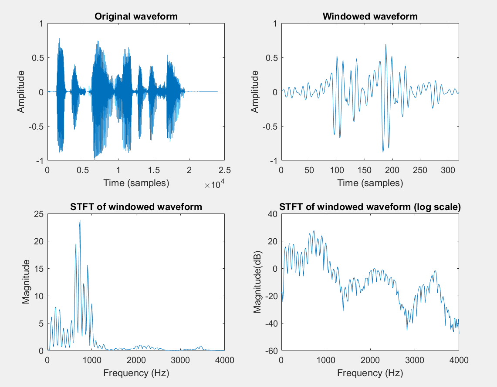
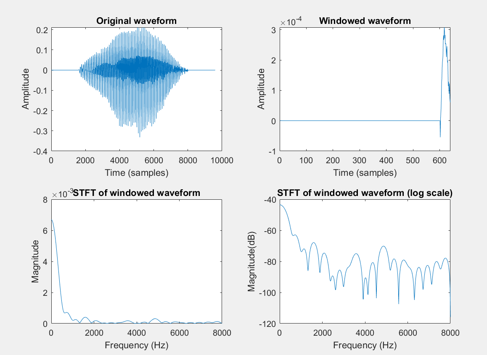

# **Lab5 Report**
### *李梓源     SID:12211225*
### *李沅朔     SID:12210301*

---
## Introduction
In this lab course, we mainly focus on the **short-time spectral analysis ** of speech signal. This approach generally includes **separating audio signal into short-time frames**, and **do spectral analysis based on frames instead on the waveform**. This approach addresses the problem that speech signal is **intrinsically time-variant**, therefore doing spectral analysis on the whole waveform would discard the information included in the audio's time-spectral characteristics. 

Tasks included in this lab assignment will cover analysing **single frame's spectrum**, the effect of **window length** on such analysis, and creating **spectrogram** based on short-time spectral analysis. 

---

## Problem 1
- **Problem description:**

Write a MATLAB program to perform short-time spectral analysis on a single frame of the given speech waveform. The program should accept the speech, the starting sample, and the frame length in ms, and plot the original waveform, the windowed waveform, the magnitude of the STFT, both in absolute value and in dB scale. 

- **Solutions and process**

1. As suggested by the slides, we desined a function `STSA_SingleFrame(filename, startsmp, framelength)` to plot all four subplots in one figure. 

2. It should read the audio file, convert the frame length from ms to samples, do fft after being zero-padded, and display the corresponding plots.

   

- **Key code segment:**

*1.* First the audio is read into the function, and the frame length is converted into the the desired unit. The audio is then separeated by the coverted index numbers.

```matlab
	[aud, fs] = audioread(filename);

    % The original framelength is in ms, convert it to samples
    framelength = framelength * fs / 1000;

    win = hamming(framelength);

    aud_win = aud(startsmp:startsmp+framelength-1) .* win;
```

*2.* FFT is called with zero padding the length to the closest exponential value of 2. The corresponding physical frequency of the fft result is the calculated.

```matlab
    nfft = 2^nextpow2(framelength);
    STFT_win = abs(fft(aud_win, nfft));

    freq = 0:fs/nfft:fs/2;
    
```

3. Then the plots are draw in one figure. The function is called to process the assigned speech signals with the given parameters.

   ```matlab
   figure
       subplot(2,2,1)
       plot(aud);
       title('Original waveform');
       xlabel('Time (samples)');
       ylabel('Amplitude');
   ...
   
   % 第一个信号应该在7000处开始，s5.wav
   
   STSA_SingleFrame("s5.wav", 7000, 40);
   
   % 第二个信号从10000开始，vowel_iy_100hz.wav
   
   STSA_SingleFrame("vowel_iy_100hz.wav", 1000, 40);
   ```

   

- **Result and Analysis:**

    + Plots for s5.wav
      

    + plots for vowel_iy_100hz.wav

        

        The function `STSA_SingleFrame` successfully analyses the spectrum of one frame in the given waveform, and draws the STFT results of them. 

---

## Problem 2
- **Problem description:** 

  In this problem, we are required to write a program to analyze a speech file and plot the following measurements: speech waveform, short-time energy, short-time magnitude, and the short-time zero-crossing.

  Appropriate window size, window shifts, and window type should be selected.

  Also, the frquency scale should be normalized.


- **Solution and process**:

1. MATLAB provides the `buffer` function which we can use to split the original waveform into frames. The frame length and the frame shift can both be configured. 
2. We can design a function called `STA` that returns 4 vectors which contain the 4 specified results. 
3. In the outer `plot_STA` script, we call the function and use its outputs to visualize the results.


- **Key code segment:**

>note: In this problem and problem 3, we use zero-crossing rate instead magnitude of zero-crossing(#zero-crossing/fram_length) since zero-crossing rate can better reveal the differences between vowels and consonants. 
```matlab
function [waveform, energy, magnitude, zero_crossing, time_axis] = STA(y, fs, R, win)

    % 输入参数检查
    L = length(win); % 窗口长度（帧长）
    N = length(y);   % 语音信号总长度

    % 初始化输出
    waveform = y; % 原始波形

    % 分帧并加窗处理（使用nodelay避免初始延迟）
    frames = buffer(y, L, L-R, 'nodelay');  % 分帧，维度 [L x num_frames]
    num_frames = size(frames, 2);           % 总帧数

    % 预分配
    energy = zeros(1, num_frames);          % 短时能量
    magnitude = zeros(1, num_frames);       % 短时幅度  
    zero_crossing = zeros(1, num_frames);   % 短时过零率

    for i = 1:num_frames
        frame = frames(:, i); % 取出一帧
        frame = frame .* win;

        % 计算短时能量
        energy(i) = sum(frame.^2);

        % 计算短时幅度
        magnitude(i) = sum(abs(frame));

        % 计算短时过零率
        zero_crossing(i) = sum(abs(diff(frame > 0)) / (L-1);
    end

    time_axis = (0:num_frames-1) * (R/fs);

end

```

The data flow within the function aligns with the provided system plot. 


We start at the $x[n]$ values, pass them through windows, and conducts corresponding calculations (i.e. taking absolute value, squaring) on selected frames of the signal. 

```matlab
[aud, fs] = audioread('s5.wav');
L = 257;
R = 128;

win = rectwin(L);
win_hanning = hann(L);
win_hamming = hamming(L);
[waveform, energy, magnitude, zero_crossing, time] = STA(aud, fs, R, win);
[waveform_hanning, energy_hanning, magnitude_hanning, zero_crossing_hanning, time_hanning] = STA(aud, fs, R, win_hanning);
[waveform_hamming, energy_hamming, magnitude_hamming, zero_crossing_hamming, time_hamming] = STA(aud, fs, R, win_hamming);
```

Then the STA function is called to return the results. 


- **Result and Analysis:**
  
    

    

    
    
    - Observations

      - **Different window types do not change zero-crossing rate**, because they do not alter the sign of any sample.
      - Magnitude and Energy analysis are alike in shape, however the **energy analhysis are more spiky.**
      - The **magnitude analysis result overall have smaller values** than energy analysis because most values in the original waveform are smaller than 1 and the squaring operation suppresses the values. 
    
      
    
      


---
## Problem 3
- **Problem description:**

We are required to show the effects of window duration on the short-time analysis of energy, magnitude, and zero crossings. Specifically, we will use frame lengths of 51, 101, 201, 401 samples, and use a rectangular window. We will continue to utilize the `STA` function we wrote in problem 2.


- **Key code segment:**


```matlab
L = [51, 101, 201, 401];
[aud, fs] = audioread('test_16k.wav');

energy_results = cell(1, length(L));
magnitude_results = cell(1, length(L));
zero_crossing_results = cell(1, length(L));
time_results = cell(1, length(L));
```

 We store corresponding results in cell arrays. The characteristics of cell arrays enable us to store vectors with different sizes together. 

```matlab
for i = 1:length(L)
    L_i = L(i);
    R = floor(L_i / 2); % to make sure R is an integer
    win = rectwin(L_i);
    [waveform, energy, magnitude, zero_crossing, time] = STA(aud, fs, R, win);

    energy_results{i} = energy;
    magnitude_results{i} = magnitude;
    zero_crossing_results{i} = zero_crossing;
    time_results{i} = time;    
end
```

For each L number, we call the STA function and store its return values into corresponding positions of the cell arrays.


- **Result and Aanalysis:**


1. The **shape of curves are consistent** throughout the changes of L. 
2. As shown in the magnitude and the energy plots, windows with **greater length** tend to have **bigger values** because they naturally include more signals. 
3. However windows with greater lengths **act like low-pass filters** and will lose high-frequency changes when compared with windows with smaller sizes.
4. In the ZC plot, because the calculating method takes average values across each window, **the magnitude of different curves remain consistent.** Also we can observe that **windows with greater length filters out high-frequency changes**, while windows with shorter lengths retain them. 

---

## Conclusion

Several short-time methods can be utilized to analyze the patterns of speech signals, including short-time energy, short-time magnitude, and short-time zero crossing rate. 

- **Short-Time Energy** measures the amplitude variation within a segmented portion of a speech signal, computed by summing the squared amplitudes of samples in a window. 
- **Short-Time Magnitude** simplifies energy calculation by summing the absolute values of signal amplitudes within a window instead of squaring them. It is mostly alike the short-time energy analysis, but it is less sensitive to sudden amplitude spikes than short-time energy.
- **Short-Time Zero Crossing Rate (ZCR)** quantifies the rate at which the signal crosses the zero amplitude axis within a window. High ZCR values correspond to **high-frequency components**, such as unvoiced fricatives (/f/, /sh/) or noise, while low ZCR values indicate low-frequency voiced sounds (e.g., vowels).

Different windows functions can affect the result of the analysis:

- Windows with larger lengths would result in bigger amplitude, however will act as lowpass filter and lose high-frequency components in signals. 
- Windows with smaller lengths would result in smaller amplitude, however retains high frequency components better.
- Window type do not change zero-crossing rate. However window length would, in a similar manner as previously mentioned.

