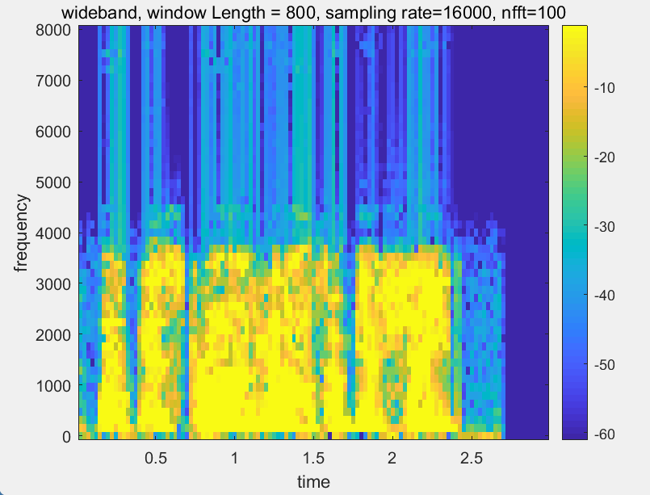

# **Lab5 Report**
### *李梓源     SID:12211225*
### *李沅朔     SID:12210301*

---
## Introduction
In this lab course, we mainly focus on the **short-time spectral analysis ** of speech signal. This approach generally includes **separating audio signal into short-time frames**, and **do spectral analysis based on frames instead on the waveform**. This approach addresses the problem that speech signal is **intrinsically time-variant**, therefore doing spectral analysis on the whole waveform would discard the information included in the audio's time-spectral characteristics. 

Tasks included in this lab assignment will cover analysing **single frame's spectrum**, the effect of **window length** on such analysis, and creating **spectrogram** based on short-time spectral analysis. 

---

## Problem 1
- **Problem description:**

Write a MATLAB program to perform short-time spectral analysis on a single frame of the given speech waveform. The program should accept the speech, the starting sample, and the frame length in ms, and plot the original waveform, the windowed waveform, the magnitude of the STFT, both in absolute value and in dB scale. 

- **Solutions and process**

1. As suggested by the slides, we desined a function `STSA_SingleFrame(filename, startsmp, framelength)` to plot all four subplots in one figure. 

2. It should read the audio file, convert the frame length from ms to samples, do fft after being zero-padded, and display the corresponding plots.

   

- **Key code segment:**

*1.* First the audio is read into the function, and the frame length is converted into the the desired unit. The audio is then separeated by the coverted index numbers.

```matlab
	[aud, fs] = audioread(filename);

    % The original framelength is in ms, convert it to samples
    framelength = framelength * fs / 1000;

    win = hamming(framelength);

    aud_win = aud(startsmp:startsmp+framelength-1) .* win;
```

*2.* FFT is called with zero padding the length to the closest exponential value of 2. The corresponding physical frequency of the fft result is the calculated.

```matlab
    nfft = 2^nextpow2(framelength);
    STFT_win = abs(fft(aud_win, nfft));

    freq = 0:fs/nfft:fs/2;
    
```

3. Then the plots are draw in one figure. The function is called to process the assigned speech signals with the given parameters.

   ```matlab
   figure
       subplot(2,2,1)
       plot(aud);
       title('Original waveform');
       xlabel('Time (samples)');
       ylabel('Amplitude');
   ...
   
   % 第一个信号应该在7000处开始，s5.wav
   
   STSA_SingleFrame("s5.wav", 7000, 40);
   
   % 第二个信号从10000开始，vowel_iy_100hz.wav
   
   STSA_SingleFrame("vowel_iy_100hz.wav", 1000, 40);
   ```

   

- **Result and Analysis:**

    + Plots for s5.wav
      

    + plots for vowel_iy_100hz.wav

        

        The function `STSA_SingleFrame` successfully analyses the spectrum of one frame in the given waveform, and draws the STFT results of them. 

---

## Problem 2
- **Problem description:** 

  In this problem, we are required to write a program to perform and compare the results of multiple short-time analyses. In this problem, the effects of different window types  (Hamming, Rectangular) and window length (5, 10, 20, 40, in ms ) are discussed. 


- **Solution and process**:

1. This task requires us to plot different data lines on the same graph, so we would first initialize two figures and reuse them for the drawing later. Also we draw the constant elements, including the original waveform and the labels. 
2. The main procedure will be largely the same as problem 1. We segment the original waveform, do STFT analysis, draw corresponding plots, and add legend to each subplot. 
3. In the outer script, we call the function to draw the plots. 


- **Key code segment:**

>1. We first read the audio and initiate all figures. Also, original waveform, which should be drawn only once, is also covered in this part. 
>
>   ```matlab
>   [aud, fs] = audioread(filename);
>   
>       colors = lines(num);
>   
>       figure(1)
>       sgtitle('Short-Time Analysis, with Hamming Window, Variable Frame Lengths');
>       subplot(2,2,1);
>       plot(aud);
>       title('Original waveform');
>       xlabel('Time (samples)');
>   	...
>   ```
>
>2. Then in a for loop dependent of the parameter `num`, we calculate the STFTs of the signals with corresponding lengths as stored in the `framelengths` vector.
>
>   ```matlab
>   for idx = 1:num
>           framelength = framelengths(idx);
>   
>           framelength_smp = framelength * fs / 1000;
>   
>           hamm_win = hamming(framelength_smp);
>           aud_hamm = aud(startsmp:startsmp+framelength_smp-1) .* hamm_win;
>           rect_win = rectwin(framelength_smp);
>           aud_rect = aud(startsmp:startsmp+framelength_smp-1) .* rect_win;
>   
>           nfft = 2^nextpow2(framelength_smp);
>           STFT_hamm = abs(fft(aud_hamm, nfft));
>           STFT_rect = abs(fft(aud_rect, nfft));
>   
>           freq = 0:fs/nfft:fs/2;
>   ```
>
>3. Then we plot the overlapping figures.
>
>   ```matlab
>           figure(1);
>           subplot(2,2,2);
>           plot(hamm_win, "Color", colors(idx, :), 'DisplayName', sprintf("%d", framelength));
>           hold on;
>           plot(aud_hamm, "Color", colors(idx, :), 'HandleVisibility', 'off');
>           legend('Location', 'best');
>   
>   
>           subplot(2,2,3);
>           plot(freq, STFT_hamm(1:nfft/2+1) ...
>               , 'DisplayName', sprintf("%d", framelength));
>   ```
>
>   Note that for audio lines that do not need a legend, we should turn the `'HandleVisibility'` property off. 


- **Result and Analysis:**

    

    

-  Observations

    - **Window Length:** windows with larger length have better frequency solution. However, it will sacrifice temporal solution because more samples are required for longer windows.
    - **Window Type:** spectrum processed with rectangular window is more "spiky". It indicates a better resolution, however also show that the processed signal suffers from high-frequency noise retained or introduced by side-lobe leakage. Conversely, Hamming window introduces less sidelobe leakage, sacrificing resolution.

    
---
## Problem 3
- **Problem description:**
Despite using `fft` to process a frame of audio, it's also important to understand the differences between wideband and narrowband spectrum. In the part, a function is required to plot the wideband and narrowaband spectrum in different given parameters. By comparing its differences, more details of the audio signal can be revealed.


- **Key code segment:**

> We  first do some regular process, including reading the audio file and resampling it.
```matlab
% read file
[y, fs] = audioread(filename);

% resample
if resamplerate ~= 0
    y_new = resample(y, resamplerate, fs);
    fs = resamplerate;
else
    y_new = y;
end
```

> Then in wideband analysis, several parameters are set and the spectrogram is calculated. Notablly, we set the dynamic range of the color map and a different choices for plotting colored map, gray map or both.
```matlab
% wideband spectrogram
Lwide = windowlengths(1) * fs * 1e-3;   % window length
FFTwide = FFTlengths(1) * fs * 1e-3;   % FFT length
win_wide = hamming(Lwide);
nfft = FFTwide;
noverlap = 0.5 * Lwide;   % window shift
[s_wide, w_wide, t_wide] = spectrogram(y_new, win_wide, noverlap,nfft, fs);
% log or linear
if magscale == "linear"
    W = abs(s_wide);
else
    W = mag2db(abs(s_wide));
end
% dynamic range
min_color = -100
max_color = max(W(:))
k = -(range+min_color-max_color)./2
min_new = min_color+k
max_new = max_color-k

% plot
if color == 1
    figure;
    imagesc(t_wide, w_wide, W);
    set(gca, 'YDir', 'normal');
    colorbar;
    caxis([min_new, max_new]);
    axis xy;
    xlabel('time'), ylabel('frequency')
    title(sprintf('wideband, window Length = %d', Lwide));
    colormap('gray')
    
elseif color == 2
    figure;
    imagesc(t_wide, w_wide, W);
    set(gca, 'YDir', 'normal');
    colorbar;
    caxis([min_new, max_new]);
    axis xy;
    xlabel('time'), ylabel('frequency')
    title(sprintf('wideband, window Length = %d', Lwide));
    colormap('parula')
    
else 
    figure;
    imagesc(t_wide, w_wide, W);
    set(gca, 'YDir', 'normal');
    colorbar;
    caxis([min_new, max_new]);
    axis xy;
    xlabel('time'), ylabel('frequency')
    title(sprintf('wideband, window Length = %d', Lwide));
    colormap('gray');
    
    figure;
    imagesc(t_wide, w_wide, W);
    set(gca, 'YDir', 'normal');
    colorbar;
    caxis([min_new, max_new]);
    axis xy;
    xlabel('time'), ylabel('frequency')
    title(sprintf('wideband, window Length = %d', Lwide));
    colormap('parula')
end
```

 > The same goes for narrowband analysis, where we set different parameters and plot the spectrogram., only to change the window length and FFTlength if needed.

```matlab
% narrowband spectrogram
Lnarrow = windowlengths(2) * fs * 1e-3;
FFTnarrow = FFTlengths(2);
win_narrow = hamming(Lnarrow);
nfft_narrow = FFTnarrow;
noverlap_narrow = 0.5 * Lnarrow;   % window shift
[s_narrow, w_narrow, t_narrow] = spectrogram(y_new, win_narrow,noverlap_narrow, nfft_narrow, fs);
% log or linear
if magscale == "linear"
    W = abs(s_narrow);
else
    W = mag2db(abs(s_narrow));
end
% dynamic range
min_color = -100;
max_color = max(W(:)) 
k = -(range+min_color-max_color)./2
min_new = min_color+k
max_new = max_color-k
% plot
if color == 1
    figure;
    imagesc(t_narrow, w_narrow, W);
    set(gca, 'YDir', 'normal');
    colorbar;
    caxis([min_new, max_new]);
    axis xy;
    xlabel('time'), ylabel('frequency')
    title(sprintf('narrowband, window Length = %d', Lnarrow));
    colormap('gray')
    
elseif color == 2
    figure;
    imagesc(t_narrow, w_narrow, W);
    set(gca, 'YDir', 'normal');
    colorbar;
    caxis([min_new, max_new]);
    axis xy;
    xlabel('time'), ylabel('frequency')
    title(sprintf('narrowband, window Length = %d', Lnarrow));
    colormap('parula')
    
else 
    figure;
    imagesc(t_narrow, w_narrow, W);
    set(gca, 'YDir', 'normal');
    colorbar;
    caxis([min_new, max_new]);
    axis xy;
    xlabel('time'), ylabel('frequency')
    title(sprintf('narrowband, window Length = %d', Lnarrow));
    colormap('gray');
    
    figure
    figure;
    imagesc(t_narrow, w_narrow, W);
    set(gca, 'YDir', 'normal');
    colorbar;
    caxis([min_new, max_new]);
    axis xy;
    xlabel('time'), ylabel('frequency')
    title(sprintf('narrowband, window Length = %d', Lnarrow));
    colormap('parula')
end  
```
note: parameter `color`:1 for gray; 2 for color; 3 for both


- **Result and Aanalysis:**

> Test for given parameters in the pdf
<table>
  <tr>
    <td></td>
    <td></td>
  </tr>
  <tr>
    <td></td>
    <td></td>
  </tr>
</table>

> Test for resampling rate changes(use wideband as default)

<div style="display: flex; gap: 10px;">
  
  
  
</div>


> Test for window length changes(use wideband as default)
<div style="display: flex; gap: 10px;">
  
  
  
</div>


> Test for nfft changes(use wideband as default)
<div style="display: flex; gap: 10px;">
  
  
</div>


> Test for "linear" plot(others are log plot by default)
<div style="display: flex; gap: 10px;">
  
  
</div>

1. Wideband and narrowband analysis: wideabnd and narrowband represents the length of window in time domain. A longer window means a lower resolution ratio in time domain and a higher resolution ratio in freq. domian. This explains why in *narrowband plot*, the spectrum is vertical overall and in *wideband plot* the spectrum is horizontal overall.  
2. Resampling rate analysis: the resampling rate affects the window length directly(more or less points in each frame), causing the same phonmenon mentioned above. Moreover, the higher the sampling rate is, the wider the range of frequencies can be analyzed, and more high-frequency details can be retained.
3. `nfft` analysis: `nfft` represent the number of points in `FFT` process. The nfft (number of FFT points) does not directly affect the frequency resolution, but a higher nfft makes it easier to observe formants and results in a smoother spectrogram. Conversely, a smaller nfft produces a coarser spectrogram."
4. "log" and "linear" analysis: the last comparision is about the plot type difference. In *linear plot*, the energy is enenly distributed and as we can see the spectrum is less obvious. However.
---

## Conclusion

Short-time spectrum analysis is an important approach used to analyse speech signals. The general methodology is segmenting original signal into frames, and do short-time fourier transform on those frames. It can effectively capture the information included in the chonologic patterns of a speech signal. 

Different aspects can affect the analysis. In this assignment, we discussed two main elements: the window length and the window type. To summarize in one sentence, every selection is a tradeoff. 

- window size: If you want to have better temporal solution, you would sacrifice spectral solution for it. 
- window type: If you want better resolution, you would sacrifice worse sidelobe leaks values for it. 


