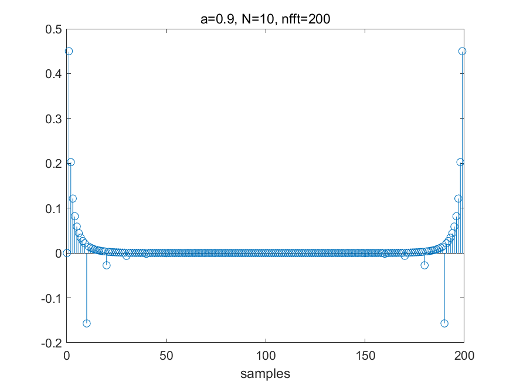

# **Lab6 Report**
### *李梓源     SID:12211225*
### *李沅朔     SID:12210301*

---
## Introduction
In this lab course, we learned a new method to analysis signals called cepstrum. Intuitively, cepstrum is the *frequency response of the frequency domain*, which is used to separate two signals doing convolution. This method will be used further in speech siganl processing and analysis, and in this lab problems are designed for us to understand its basic principles and test it on several expample siganls. 

---

## Problem 1
- **Problem description:**

Write a MATLAB program(function) to compute the real and complex cepstrum of a given siganl $x[n] = \delta[x] + 0.85\delta[x-100]$. Notably, no MATLAB functions like `cceps()` or `rceps` should be used in the code. At last, plot all three figures.

- **Solutions and process**

1. Understanding Cepstrum

Cepstrum is used to deconvlute siganls. For example, voice is sound from the vocal track, which can be viewed as a convolution of the vocal channel and the voice siganl, and cepstrum can help to deconvolute these two. The method can be illustrated by the following diagram:


`fft()` in step1 is to convert convolution to multiply. And take the logarithm in step2 is to convert multiply in step1 to addition. And finally use `ifft()` to finish the cepstrum analysis.

2. Real cepstrum and complex cepstrum

For real cepstrum, we only take the real part of the magnitude response. But in the complex cepstrum, we need to add the complex part(phase information) of the signal. Notably,phase in `fft()` is incontinuity, so we need to unwrap the signal phase inorder to do the complex cepstrum.


   

- **Key code segment:**

The code follows the ideas mentioned above and is devided into real_cep calculation and complex_cep calculation
```matlab
n = 0:100;
y = (n==0) + 0.85*(n-100==0);
N = length(y);

nfft = N;
[cY, rY] = Cepstrum(y, nfft);
quefrency_c = (0:length(cY)-1)/fs;
quefrency_r = (0:length(rY)-1)/fs;

figure
subplot(311)
stem(0:length(y)-1, y)
title('origin signal'), xlabel('samples')

subplot(312)
stem(0:length(rY)-1, rY), xlabel('Quefrency'), title('rael cepstrum')


subplot(313)
stem(0:length(cY)-1, cY), xlabel('Quefrency'), title('complex cepstrum')

function [ccepstrum, rcepstrum] = Cepstrum(y, nfft)
    % real cepstrum
    Y = fft(y, nfft);
    Y_log = log(abs(Y));
    rcepstrum  =ifft(Y_log, 'symmetric');
        
    %complex cepstrum
    phase = unwrap(angle(Y));
    ccepstrum = log(abs(Y)) + 1j * unwrap(angle(Y));   % 相位展开
    ccepstrum = real(ifft(ccepstrum));
end
```


- **Result and Analysis:**


As we can see in the result, the real cepstrum is symmetric and its x-axis have the same unit as the origin signal. Also, at the begining and the end of the signal, the siganl's frqeuency response shows more periodicity.

---

## Problem 2
- **Problem description:** 

  In this problem, we are required to write a program to perform and compare the results of multiple cepstrum. A new signal $\alpha^nu[n]$ is given and we need to test different parameters and verify its effects. 


- **Solution and process**:

1. Same as problem1, we need to calculate both the real and the complex cepstrum of the given siganl.

2. Change the parameters and compare the results.


- **Key code segment:**

>1. We first define differnet parameters and then input the parameters in the function to do the follow up calculation.

```matlab
clc, clear
% parameters, change for different cases
a = 0.9;   % 0.5, 0.9
N = 200;   % 10, 200
nfft = 256;   % 10, 16, 200, 256
n = 0:N-1;
y = a.^n .* (n>=0);
% real cepstrum
Y = fft(y, nfft);
Y_log = log(abs(Y));
Y_cep = ifft(Y_log);

figure;
stem(0:length(Y_cep)-1, Y_cep), title('a=0.9, N=200, nfft=256'), xlabel('samples')
saveas(gcf, "D:/作业提交/大三 下/语音信号处理/lab6/P2_16_r.png", 'png')

% complex cepstrum
phase = unwrap(angle(Y));
Y_ccep = Y_log + 1i*phase;
Y_ccep = ifft(Y_ccep);
figure
stem(0:length(Y_ccep)-1, Y_ccep), title('a=0.5, N=200, nfft=256'), xlabel('samples')
saveas(gcf, "D:/作业提交/大三 下/语音信号处理/lab6/P2_16_c.png", 'png')
```


- **Result and Analysis:**
  + Real ceptsrum
    <div style="display: flex; flex-wrap: wrap; gap: 10px; justify-content: center;">
    
    
    
    
    
    
    
    
    
    
    
    
    
    
    
    
    </div>

  + Complex cepstrum
      <div style="display: flex; flex-wrap: wrap; gap: 10px; justify-content: center;">
    
    
    
    
    
    
    
    
    
    
    
    
    
    
    
    
      </div>

-  Observations

    - **N:** N is the length of the given siganl, when the signal length grow longer, a larger nfft is required theoretically.
    - **nfft:** the number of `fft()` specifies the accuracy of the cepstrum. when nfft is larger than N, the quefrency performs much more precise. However, when nfft is smaller than N, the signal is truncated and shows less details.
    - **a:** The parameter a directly change the expression of the signal, and as we can see the difference clearly in the result.

    
---
## Problem 3
- **Problem description:**
This task requires us to compute the complex and real cepstra for a section of voiced and a section of unvoiced speech. We are required to plot the signal, the log magnitude spectrum, the real cepstrum, and a low quefrency liftered log magnitude spectrum. 

- **Key code segment:**

> ```matlab
> [aud, fs] = audioread("test_16k.wav");
> 
> t = ( 1:400 )' / fs;
> voiced = aud(13000:13399);
> unvoiced = aud(3400:3799);
> 
> hamm = hamming(400); % Hamming window of length 400
> voiced = voiced .* hamm;
> unvoiced = unvoiced .* hamm;
> 
> voiced_padd = [voiced; zeros(512-length(voiced), 1)];
> unvoiced_padd = [unvoiced; zeros(512-length(unvoiced), 1)];
> 
> voiced_Spec = fft(voiced_padd, 512); % FFT of voiced signal
> unvoiced_Spec = fft(unvoiced_padd, 512); % FFT of unvoiced signal
> 
> voiced_Spec = log(abs(voiced_Spec)); % Logarithm of the magnitude spectrum
> unvoiced_Spec = log(abs(unvoiced_Spec)); % Logarithm of the magnitude spectrum
> 
> [voiced_ccep, voiced_rcep] = Cepstrum(voiced_padd, 512); % 512 is the closese 2^n to 400
> [unvoiced_ccep, unvoiced_rcep] = Cepstrum(unvoiced_padd, 512); % 512 is the closese 2^n to 400
> 
> ```
>
> We select the audio segments as specified in the pdf, zero padds the signals to nearest 2^n and calculates the log spectrum by using fft. The real and complex cepstrum are calculated by reusing the Cepstrum function we wrote earlier. 
>
> ```matlab
> cutoff = 30; % cut-off quefrency
> lifter = [ones(cutoff,1); zeros(512-cutoff,1)]; 
> 
> voiced_liftered = voiced_rcep .* lifter; % Liftered cepstrum of voiced signal
> unvoiced_liftered = unvoiced_rcep .* lifter; % Liftered cepstrum of unvoiced signal
> 
> voiced_liftered_spectrum = abs(fft(voiced_liftered, 512)); % Liftered cepstrum to spectrum of voiced signal
> unvoiced_liftered_spectrum = abs(fft(unvoiced_liftered, 512)); % Liftered cepstrum to spectrum of unvoiced signal
> ```
>
> We used a rectangular window of length=30 on the cepstrum to do the liftering. After this, we convert it back into log magnitude spectrum by using fft and taking absolute value.
- **Results and Analysis:**


For the unvoiced signal, the spectrum is relatively "messy", not displaying dominant frequencies. The cepstrum is spiky and no prominent peaks can be seen. After liftering, the spectrum is smoothed, although there are still little observable regular shapes in its envelope. 

In the spectrum of the voiced signal, multiple peaks can be observed. They are likely the resonant peaks. In the cepstrum, at about 10 and 150 samples, peaks can be observed. After liftering, the consonant waves of the voiced signals are displayed more smoothly. 


---

## Conclusion

In this lab, we have learned the basic principles of cepstrum and its applications in speech signal processing. We also learned how to use MATLAB to implement the algorithm and visualize the results. The results show that cepstrum can effectively separate the excitation source and the vocal tract response, which is useful for further analysis and processing of speech signals. We also learned how to use liftering to smooth the cepstrum and obtain a more interpretable spectrum. Overall, this lab has deepened our understanding of cepstrum and its applications in speech signal processing.


