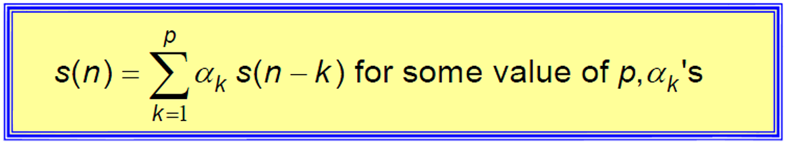
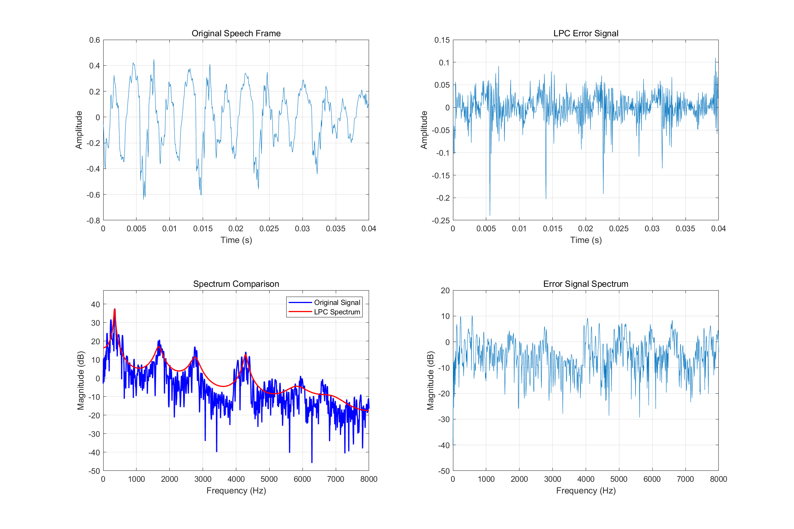

# **Lab7 Report**
### *李梓源     SID:12211225*
### *李沅朔     SID:12210301*

---
## Introduction
In this lab course, we learn to analyse speech signal using Linear Predictive Analysis(LPA). This approach focuses on using a set of past samples to predict the current speech sample by a linear combination. This approach regards the vocal tract as a time-varying FIR filter, and the actual voice being a stimulus signal passed through the filter. LPA is useful to various speech signal processing tasks such as encoding, compression, feature extraction and speech synthesis. 

---

## Problem 1
### **Problem description:** 

Develop a MATLAB program to perform Linear Predictive Coding (LPC) analysis on a specified frame of speech and display the following results:

1. Original Speech Signal: Plot the original speech signal for the specified frame.

2. LPC Error Signal: Display the error signal obtained from the LPC analysis for the same frame.

3. Log Magnitude Spectrum: Show the short-time Fourier transform (STFT) log magnitude spectrum (in dB) of the original signal, overlaid with the LPC spectrum for the specified frame.

4. Error Signal Spectrum: Plot the log magnitude spectrum of the LPC error signal.

### **Solutions and process** 
1. Process Overvirw
A function `LPC` is written solely to calculate the LPC residule signal.
- **Signal Preprocessing**  
   - Load the test wav file `test_16k.wav`.  
   - Extract a fixed-length frame (e.g., 640 samples starting at sample 6000).  

- **LPC Parameter Estimation**  
   - Compute autocorrelation and solve Yule-Walker equations to derive LPC coefficients.  

- **Spectral Analysis**  
   - Compare the original signal’s spectrum with the LPC model’s spectrum.  
   - Analyze the error signal’s spectral.   


### Key Steps  
This is the main idea of LPC: to use the earlier parameters to predict the future parameters:


#### (1) Autocorrelation Computation  
We first calculate \(R(k)\) for lags \(k = 0\) to \(p\):  
  $$
  R(k) = \sum_{n} s(n) \cdot s(n+k)
  $$
In MATLAB, we use the function `xcorr` to do this task.    

#### (2) Yule-Walker Equation Solving  
First, we constuct a Toeplitz matrix using MATLAB function `toeplitz`, then using `-R \ r(2:order+1)`to solve the Yule-Walker equation  

#### (3) Residual Signal Generation  
Using a math representation:
$$
  e(n) = s(n) + \sum_{k=1}^{p} a_k \cdot s(n-k)
$$  
Additionally, we further pass the signal to a filter. The function `filter` is used.


   

### **Key code segment:**

The code follows the ideas mentioned above and is devided into real_cep calculation and complex_cep calculation
```matlab

    [x, fs] = audioread('test_16k.wav');
    x = x(:, 1); 
    start_sample = 6000;
    frame_size = 640;
    order = 12;
    frame = x(start_sample : start_sample + frame_size - 1);
    [a, errsig] = LPC(frame, order);
    
    nfft = 2048;
    freq = (0:nfft/2) * fs / nfft;     
    spec_orig = abs(fft(frame, nfft));
    spec_orig = 20*log10(spec_orig(1:nfft/2+1));
    
    [h, ~] = freqz(1, [1; -a], nfft/2+1, fs);
    spec_lpc = 20*log10(abs(h));
    spec_err = abs(fft(errsig, nfft));
    spec_err = 20*log10(spec_err(1:nfft/2+1));
    
    figure('Units', 'normalized', 'Position', [0.1, 0.1, 0.8, 0.8]);
    subplot(2,2,1);
    plot((0:frame_size-1)/fs, frame);
    title('Original Speech Frame');
    xlabel('Time (s)');
    ylabel('Amplitude');
    grid on;
    
    subplot(2,2,2);
    plot((0:frame_size-1)/fs, errsig);
    title('LPC Error Signal');
    xlabel('Time (s)');
    ylabel('Amplitude');
    grid on;
    
    subplot(2,2,3);
    plot(freq, spec_orig, 'b', 'LineWidth', 1.5);
    hold on;
    plot(freq, spec_lpc, 'r', 'LineWidth', 1.5);
    hold off;
    title('Spectrum Comparison');
    xlabel('Frequency (Hz)');
    ylabel('Magnitude (dB)');
    legend('Original Signal', 'LPC Spectrum');
    grid on;
    ylim([-50, max(spec_orig)+10]);
    
    subplot(2,2,4);
    plot(freq, spec_err);
    title('Error Signal Spectrum');
    xlabel('Frequency (Hz)');
    ylabel('Magnitude (dB)');
    grid on;
    saveas(gcf, 'D:/作业提交/大三 下/语音信号处理/lab7/P1.png', 'png')
  
    

    function [a, errsig] = LPC(x, order)
    frame_size = length(x);
    r = xcorr(x, x);
    r = r(frame_size : frame_size + order);
    R = toeplitz(r(1:order));              % 构建Toeplitz矩阵
    a = -R \ r(2:order+1);                 % 求解Yule-Walker方程
    a = -a;                               
  
    errsig = filter([1; -a], 1, x);
    end

```


- **Result and Analysis:**


As we can see in the result, LPC successfully captures main formant structure. Since we did a autocorrelation, the error at the beginnig and at the end is declined.
Also, in the error signal spectrum, the signal is flat, which meets our expectations.

---

## Problem 2
- **Problem description:** 

  In this problem, we are required to write a MATLAB program to analyze a speech signal using LPC analysis methods, extract the error signal, and then use the error sinal to do exact reconstruction of the original speech file. At the end of the program, we should also plot the original speech signal, the error signal, and the resynthesized speech signal. 


- **Solution and process**:

1. We first cut the original speech signal in to frames with specified length and overlap values. A hanning window is added to the frames to prevent spectral leakage. Also, the overlapped summation of the window's response should be equal to a constant value, which could be set by using the 'periodic' parameter. 

1. For every frame, we use the self-correlation approach to solve for the linear prediction coefficients. 

1. Use formula $ \hat{s}(n)=\sum_{k = 1}^{p}a_{k}s(n - k) $ to predict the samples of frames using the calculated linear prediction coefficients. 

1. To achieve perfect reconstruction, do an addition of predicted signal and the error. 
   $$
   s(n)=\hat{s}(n)+e(n)=\sum_{k = 1}^{p}a_{k}s(n - k)+e(n)
   $$


- **Key code segment:**

1. We first define differnet parameters and cut the original waveform into frames using the buffer() function provided in MATLAB. 

```matlab
[aud, fs] = audioread('s5.wav');
lpc_size = 320;
lpc_shift = 80;
lpc_order = 12;

% 确保aud是列向量
aud = aud(:);

% 使用buffer函数将信号分帧
y = buffer(aud, lpc_size, lpc_size - lpc_shift, 'nodelay'); % 320x297
num_frames = size(y, 2); % 一共有297帧

% 创建汉宁窗
hann_win = hann(lpc_size, "periodic"); % 帧长度为320

% 初始化变量
est_frames = zeros(lpc_size, num_frames); % 复原后的帧
residual = zeros(lpc_size, num_frames);   % 残差
a_coeffs = zeros(num_frames, lpc_order + 1); 
```


2. Then for every frame, we take its self correlation and use levinson method to calculate LPC. 

```matlab
history_buffer = zeros(lpc_order, 1); % 初始化历史缓冲区

for i = 1:num_frames
    frame = y(:, i); % 当前帧, 320x1
    % 对当前帧加窗
    windowed_frame = frame .* hann_win; % 320x1

    R = xcorr(windowed_frame, lpc_order, 'unbiased'); % 计算自相关
    R = R(lpc_order + 1:end); % 取出自相关系数, 13x1
    R = R(:); % 确保是列向量
    % 计算LPC系数
    [a_coeffs(i, :), ~] = levinson(R, lpc_order); % 1x13

    extended_frame = [history_buffer; frame];

    pred_signal = filter([0 -a_coeffs(i, 2:end)], 1, extended_frame);
    
    % 只取当前帧部分的预测结果
    est_frames(:, i) = pred_signal(lpc_order+1:end);
    
    % 计算残差
    residual(:, i) = frame - est_frames(:, i);
    
    % 更新历史缓冲区用于下一帧
    history_buffer = frame(end-lpc_order+1:end);

end
```

Because the analysis needs sample points before the first sample point of a frame, we utilize a historical buffer (which is all zeros for the first frame) to store those previous samples. For every frame, we also calculate the predicted signal by using a filter function with LPC coefficient input. The error $e[n]$ (which is named residual in the code) is then calculated by subtracting the original signal with the estimated frames. 

3. To achieve perfect reconstruction, we add up the reconstructed signal and the error vector.

   ```matlab
   reconstructed_signal = zeros(length(aud),1);
   residual_sum = zeros(length(aud), 1);
   count = zeros(length(aud), 1);
   
   for i = 1:num_frames
       % 计算当前帧在原信号中的位置
       start_idx = (i-1) * lpc_shift + 1;
       end_idx = start_idx + lpc_size - 1;
       
       if end_idx <= length(reconstructed_signal)
           % 结合预测信号和残差来重构原始信号
           % s(n) = 预测信号 + 残差
           frame_reconstruction = est_frames(:,i) + residual(:,i);
           
           % 将重构帧添加到重构信号
           reconstructed_signal(start_idx:end_idx) = reconstructed_signal(start_idx:end_idx) + frame_reconstruction;
           residual_sum(start_idx:end_idx) = residual_sum(start_idx:end_idx) + residual(:, i);
           count(start_idx:end_idx) = count(start_idx:end_idx) + 1;
       end
   end
   ```


- **Result and Analysis:**

    

- Observations

    - As shown in the figure, the reconstruction process is successful..
    - The sound of perfectly reconstructed speech is identical with the original signal. This proves that LPA successfully separates the vocal tract frequency response and the error(stimulus signals).
    - The error signal sounds hissy, resembling the stimulus fed through the vocal tracts, i.e. the airflow from the lungs. We can still understand speech from the residual signal. 
    
    

---

## Conclusion

In this lab, we have learned the basic principles of LPC, which is a useful method to predict the properties of differnt speech signals.


