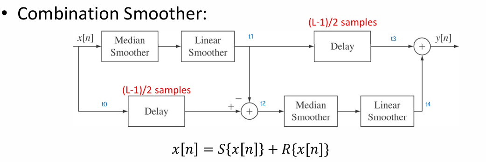
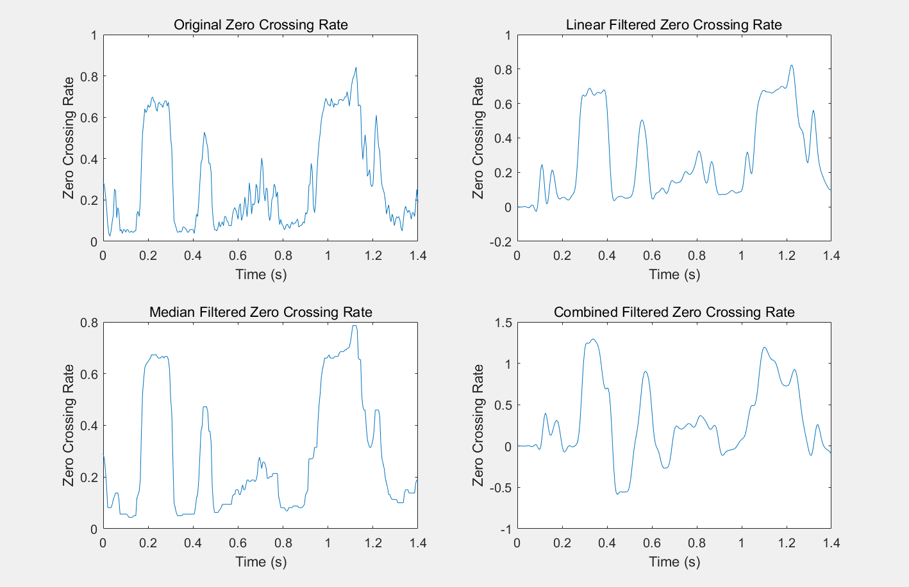
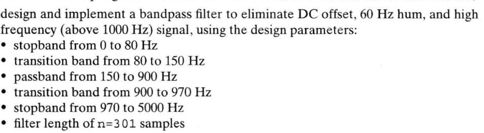
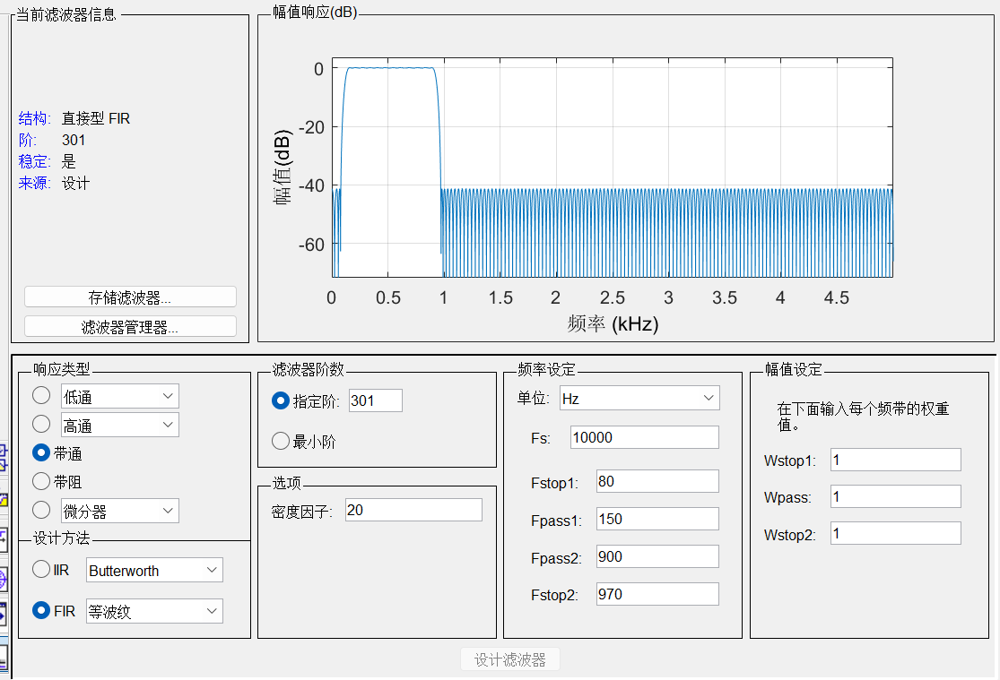
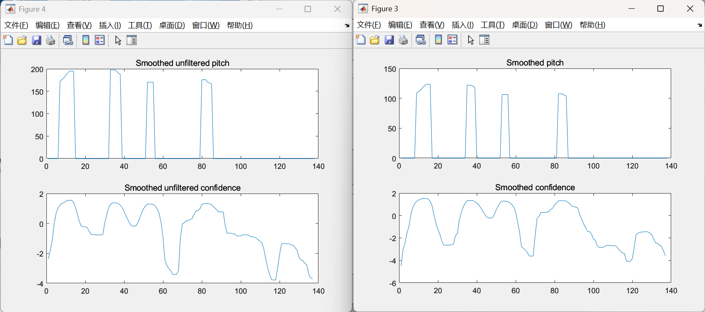
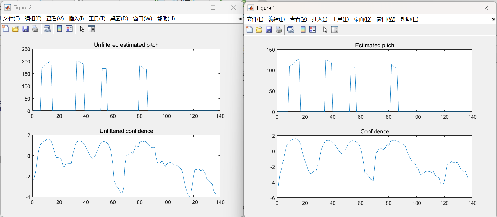
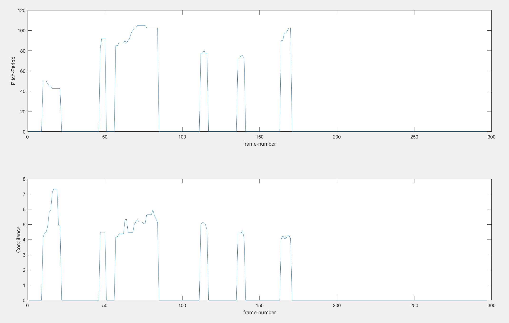
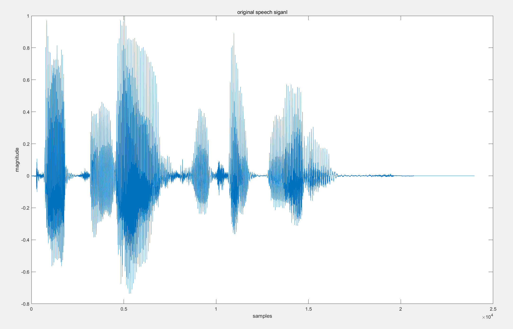

# **Lab8 Report**
### *李梓源     SID:12211225*
### *李沅朔     SID:12210301*

---
## Introduction
In this lab course, we will utilize median smoothing on several speech parameters to extract speech features. Also, we will use some commonly used altorithms on pitch estimation. In task 1, we will compare different smoothers on short-time zero-crossing estimates, including linear, median and combination smoothers. Task 2 and task 3 are pitch detectors that rely on autocorrelation and cepstrum respectively.

---

## Problem 1
### **Problem description:** 

In this task we will calculate the short-time zero-crossing rate and compare the effects of linear, median, and combination smoothers on short-time zero-crossing rate. 

### **Solutions and process** 
The process of this task is straightforward. We first utilize a function `ZCA(y, fs, R, win)` to calculate the zero crossing rate of the audio signals, and do filtering on the calculated data.

- Filter Design

We will use the FilterDesigner matlab module to design the filters. 

1. For linear smoothing, we designd a FIR lowpass filter of length L=41 and low frequency band about 1.6kHz for the original waveform. 
2. For the median smoother, we will introduce a running buffer that stores 7 samples and takes the median of the samples as an output for the zero-crossing rate contour.
3. The combination smoother is a mix of delay, median smoother, and linear smoother. The diagram is listed below:



The designed filter are stored in .mat format and loaded into the workspace when needed. 


### **Key code segment:**

- ZCA.m

This function calculates the ZCA curve of a given signal, using a given window function and a given shift in samples. The length of the window function is taken as the length of the window taken from the waveform. 

```matlab
function [waveform, zero_crossing, time_axis] = ZCA(y, fs, R, win)
% R = shift in sample
% 窗长度和win的长度一致

% 输入参数检查
L = length(win); % 窗口长度（帧长）

% 初始化输出
waveform = y; % 原始波形

% 分帧并加窗处理（使用nodelay避免初始延迟）
frames = buffer(y, L, L-R, 'nodelay');  % 分帧，维度 [L x num_frames]
num_frames = size(frames, 2);           % 总帧数

zero_crossing = zeros(1, num_frames);   % 短时过零率

for i = 1:num_frames
    frame = frames(:, i); % 取出一帧

    % % 加窗
    frame = frame .* win;

    % 计算短时过零率
    zero_crossing(i) = sum(abs(diff(frame > 0))) / (L-1);
end

time_axis = (0:num_frames-1) * (R/fs);

end

```

- MedianSmoother.m

```matlab
function y = MedianSmoother(x, L)
%MEDIANSMOOTHER 给出窗长度为L的中值滤波
x = reshape(x, 1, length(x));

padding_length = floor(L/2);
x_padded = [ones(1, padding_length)*x(1), x, ones(1, padding_length)*x(end)];
y = zeros(size(x));

for i = 1:length(x)
    window = x_padded(i:i+L-1);
    y(i) = median(window);
end

end
```

Padding based on initial and final value are conducted on this signal. 

- Combination Smoother

There are multiple intermediate amounts in the diagram. Here we assign each node a variable to store the values. The delay here are implemented by adding zeros at the front of the vector.

```matlab

t1 = MedianSmoother(zero_crossing_vector, L_filt);
t1 = filter(Filt_task1, 1, t1);
t0 = [zeros(1, (L_filt-1)/2), zero_crossing_vector];
t0 = t0(1:length(zero_crossing_vector));

t2 = t0 - t1;
t3 = [zeros(1, (L_filt-1)/2), t1];
t3 = t3(1:length(zero_crossing_vector));

t4 = MedianSmoother(t2, L_filt);
t4 = filter(Filt_task1, 1, t4);

y_comb = t3+t4;

figure
plot(time_axis, y_comb);
```


- **Result and Analysis:**



As we can observe in the figures, the original zero crosing rate contains a lot of notches and spikes, and three approaches all successfully smooths out those characteristics. The combined filter does the most filtering, while median and linear filter waveforms keep most of the original waveform's characteristics. The linear filtered result is smoother while the median smoother erases a lot of notches. 

Overall I believe in this case the linear filter keeps the original characteristics best. 


---

## Problem 2
- **Problem description:** 

  In this task we will design a pitch detector using the modified autocorrelation function. Autocorrelation over short frames can find repeating patterns, and the highest peak after zero lag corrsponds to the pitch period. This approach is robust to noise, and it works well with harmonic signals. However, the confidence can drop low when it is facing low-frequencies or rapidly changing pitch. 


- **Solution and process**:

We will design a function called  `PitchDetector_Autocorrelation(aud, fs, gender)`. It will output the estimated pitch and the confidence of the estimated pitch for both the original signal and a filtered version. The gener variable is used to specify the range where we identify the autocorrelation peaks. 

- **Key code segment:**

1. Reading and resampling

```matlab
fsout = 10000;
y = resample(aud, fsout, fs);
```

We will read in the speech file and convert the sampling rate to a standard value of 10kHz.

2. We have designed a filter to eliminate DC offset, 60Hz hum, and high frequency signals. 






The speech file is filtered using this filter. 

```matlab

if ~exist("task2_aud", "dir")
    mkdir("task2_aud")
end

audiowrite("task2_aud/Filtered.wav", y_filt, fsout);
audiowrite("task2_aud/Original.wav", y, fsout);
```


3. Frames with length=400 and frame shift of 100 samples are cut using the buffer() function.

   ```matlab
   L = 400;
   R = 100;
   
   frames = buffer(y_filt, L, L - R, "nodelay");
   num_frames = size(frames, 2);
   ```

4. The autocorrelation of filtered and unfiltered function are calculated.

```matlab
for i = 1:num_frames-1
    frame = frames(:, i);
    unfilt_frame = unfilt_frames(:, i);

    nextframe = frames(:, i+1);
    unfilt_nextframe = unfilt_frames(:, i+1);

    s1 = frame;
    s2 = [frame; nextframe(1:pdhigh)];
    s1_unfilt = unfilt_frame;
    s2_unfilt = [unfilt_frame; unfilt_nextframe(1:pdhigh)];

    correlation = xcorr(s1, s2, 'none');
    correlation = correlation(length(s2):end);

    unfilt_correlation = xcorr(s1_unfilt, s2_unfilt, 'none');
    unfilt_correlation = unfilt_correlation(length(s2_unfilt):end);

    [max_val, max_idx] = max(correlation(pdlow:pdhigh));
    max_idx = max_idx + pdlow - 1;  % 调整索引以匹配原始correlation数组

    [max_val_unfilt, max_idx_unfilt] = max(unfilt_correlation(pdlow:pdhigh));
    max_idx_unfilt = max_idx_unfilt + pdlow - 1;  % 调整索引以匹配原始correlation数组

    estimated_pitch(i) = fsout / max_idx;  % 计算音高
    estimation_confidence(i) = max_val;  % 计算置信度

    unfilt_pitch(i) = fs / max_idx_unfilt;  % 计算未滤波音高
    unfilt_conf(i) = max_val_unfilt;  % 计算未滤波置信度

end

```

5. After autocorrelation, the confidence is converted to a log score. Estimations for sections with too low confidence are set to zero.

```matlab
log_confidence = log10(estimation_confidence);
max_log_confidence = max(log_confidence);
threshold = 0.75*max_log_confidence;
estimated_pitch(log_confidence < threshold) = 0;  % 将低置信度的音高设为0

log_confidence_unfilt = log10(unfilt_conf);
max_log_confidence_unfilt = max(log_confidence_unfilt);
threshold_unfilt = 0.75*max_log_confidence_unfilt;
unfilt_pitch(log_confidence_unfilt < threshold_unfilt) = 0;  % 将低置信度的音高设为0

pitch_vector = estimated_pitch;
confidence_vector = log_confidence;

unfilt_conf = log_confidence_unfilt;
```


- **Result and Analysis:**

    

    

    

- Observations

    - As shown in the figure, the estimation process is successful. Pitchs are derived using autocorrelation function.
    - The estimated pitch, when the speech is unfiltered, is overall higher than filtered speech. This shows that filtering can affect the results of autocorrelation estimation. I believe that the unfiltered version is more accurate.
    - The median smoother for the confidence eliminates notches in the confidence curve. However in this case it has little influence on the estimated pitch. 
    
    
---

## Problem 3
### **Problem description:** 

Develop a MATLAB function to derive the pitch period(frequency) and confidence score with the requirements:

1. nfft of `fft` is specified as 4000.

2. To avoid repitation in a small period of time, set the cepstrum around the primary pitch as 0.

3. Expand the pitch index by comparing adjascent pitch magnitude and set as the same value if the difference is less than 10%

4. The rest requirments is the same to problem2

### **Solutions and process** 
1. Process Overvirw
The overall idea of this method is using the cepstrum to find the repetitiveness in the frequency. As shown in the function, pitch frequency $f_0$ is the samllest component in the harmonic wave. By deriving the "frquency domain of frequeny domain", we can generally find the pitch period.

$$
harmonic(f) = \delta(f-f_0) + \delta(f-2f_0) + ... + \delta(f-nf_0)
$$
The following is the detailed process.

- **Signal Preprocessing**  
   - Resample the signal and cut it in frames.
   - Use `hamming` window to preprocess the signal.

- **Cepstrum Analysis**  
   - Set query range acorrding to the gendedr and find the cepstrum of each frame.
   - Find the primary pitch and secondary pitch in the cepstrum.

- **Reliable Range**  
   - Expand the range acorrding to the requirements. 
   - Smooth the pitch period vector.   


### Key Code Segments  
The following is a few segments in a whole function `PitchDetector_Cepstrum` along with a test code.
####  1. Resample and preprocess
```matlab
% 重采样
    Fs = 10000;
    s = resample(s, Fs, fs);
    nfft = 4000;

    if gender == 1
        nlow = 40;
        nhigh = 167;
%         nlow = Fs/200;
%         nhigh = Fs/75;
    elseif gender == 0
        nlow = 28;
        nhigh = 67;
    end
    
    % 分帧
    frame_length = 400;  
    frame_shift = 100;   
    nframe = floor((length(s) - frame_length)/frame_shift) + 1;
    primary_pitch = zeros(1, nframe);
    secondary_pitch = zeros(1, nframe);
    pitch_period = zeros(1, nframe);
    confidence = zeros(1, nframe);
    pthrl = 4;
```

#### 2. Cepstrum Analysis
```matlab
% 倒谱分析
    for i=1:nframe
        begin = (i-1)*frame_shift + 1;
        frame = s(begin:begin+frame_length-1);
        frame = frame .* hamming(length(frame));
        
        % 取倒谱
        min_sample = round(Fs/nhigh);
        max_sample = round(Fs/nlow);
        spectrum = fft(frame, nfft);
        cepstrum = abs(real(ifft(log(abs(spectrum) + eps))));
        cepstrum = cepstrum(min_sample:max_sample)   % 限定查找范围
        
        % 取两个主峰
        [p1, pd1] = max(cepstrum)   % 第一峰，取绝对值
        zero_range = max(1,pd1-4):min(length(s), pd1+4);
        primary_pitch(i) = p1;
        cepstrum(zero_range) = 0;
        [p2, pd2] = max(cepstrum)   % 第二峰
        secondary_pitch(i) = p2;
        p1/p2;
        cepstrum;
        
        % 判断reliable区域
        if p1/p2 > pthrl
%             pitch_period(i) = (pd2+pd1)/2;
            pitch_period(i) = pd1;
            confidence(i) = p1/p2;
        else
            pitch_period(i) = 0;   % 不可靠帧
        end
    end   % end for
    
    
    % 扩展区域
    for i=2:nframe-1
        if pitch_period(i-1)~=0 && abs((pitch_period(i)-pitch_period(i-1))) < 0.1   % 向后拓展
            pitch_period(i-1) = pitch_period(i);
        end
        if pitch_period(i+1)~=0 && abs((pitch_period(i+1)-pitch_period(i))) < 0.1   % 向前扩展
            pitch_period(i+1) = pitch_period(i);
        end
    end
    
    % 平滑处理
    pitch_period_smooth = MedianSmoother(pitch_period, 5);
    confidence_smooth = MedianSmoother(confidence, 5);
```
Here, we use the function `MedianSmooth` derived in problem1.

#### 3. Test and Run
```matlab
[y, fs] = audioread('s6.wav');
figure
plot(y)
gender = 1;
[pitch_period, confidence] = PitchDetector_Cepstrum(y, fs, gender);
pitch_period
confidence;
% pitch = 1./pitch_period

figure
subplot(211), plot(2.5*pitch_period), ylabel('Pitch-Period'), xlabel('frame-number')
subplot(212), plot(confidence), ylabel('Condifence'), xlabel('frame-number')
```

### Results and Observation


As we can see in the result, the cepstrum method sucessfully estimate the pitch period of the speech. The audio is a male voice and this trais make sense according to the result. 


Also, as we can see in the original speech, there are maily six segments in the speech. As we can see in the result, there's also six pitch period.Additionally, since we set the threshold of p1/p1 as 4, the confidence score are all more larger than 4.

---

## Conclusion

In the process of estimating pitch period(frequency), two methods are used in this trail. Generally, the cross-correlation method focus on the repetitiveness in time-domain and the cepstrum method focus on the same traits in the frequency-domain. As shown in the results, both methods can estimate the pitch frequency, and each sentence have differnet pitch due to the emotion. But for a specific gender, their pitch frequency is roughly the same.

