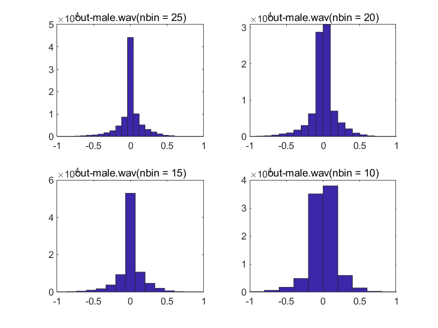
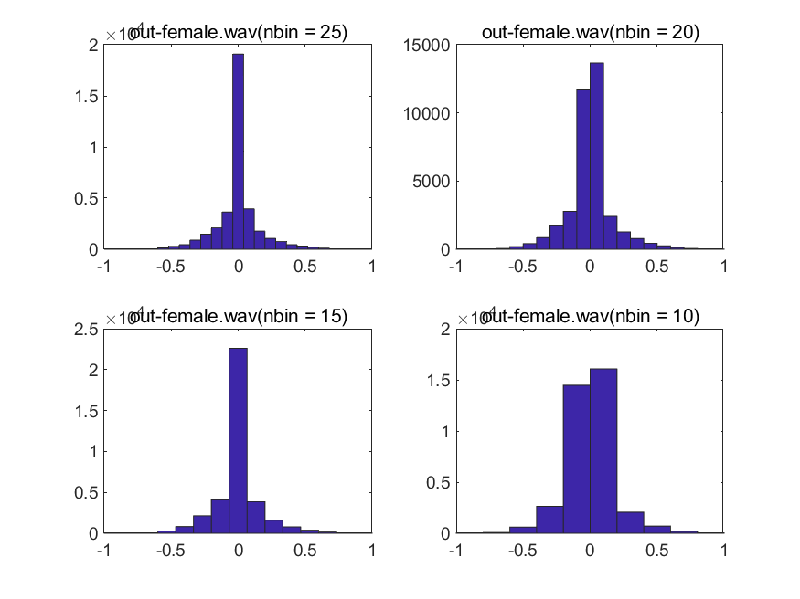
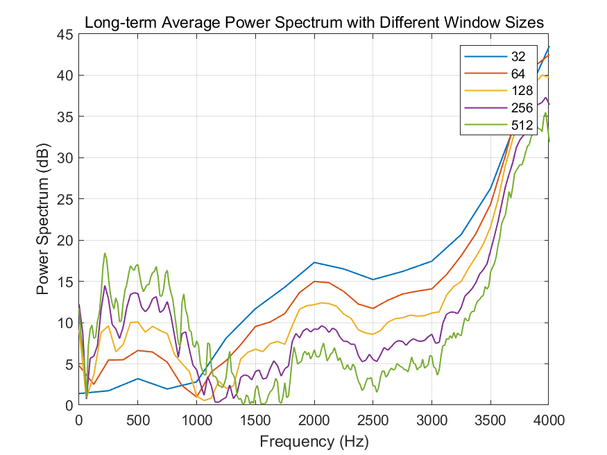
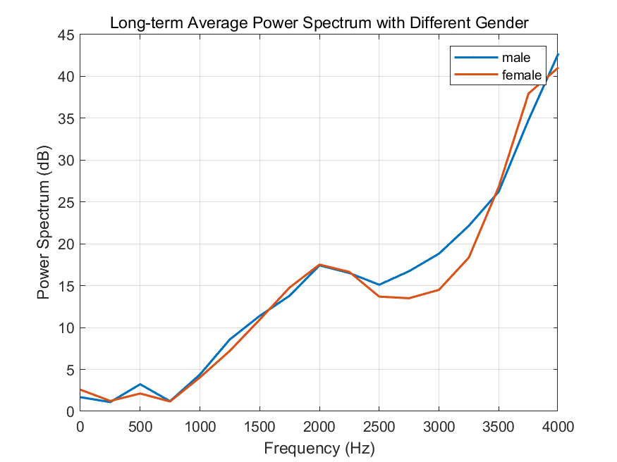

# **Lab9 Report**
### *李梓源     SID:12211225*
### *李沅朔     SID:12210301*

---
## Introduction
This lab course mainly focus on statistical modeling and digital coding. It includes two main tasks: analyzing speech signal statistics and power spectra using concatenated files (out_s1_s6.wav, out_male.wav, out_female.wav) with varying window sizes; and experimenting with uniform quantization using MATLAB's fxquant function to study quantizer characteristics, error sequences, and noise spectra across different bit depths (4-10 bits). Several features can be observed in the simulation result.

---

## Problem 1
### Problem description

1. Concatenate a few given speech file into 'out_s1_s6.wav', 'out_male.wav', 'out_female.wav'.
2. Derive several characteristcs of the concatenated speech file and plot the histogram saperatly.
3. Use MATLAB function `pspect()` to eastimate the long-term average power spectrum of speech with different window length.
4.  Repeat (3) with diffent wav file.

### Solutions and process

1. Speech File Concatenation

Plot all the six wav file and find the beginning and ending of each file. Then use MATLAB function `vertcat()` to concatenate them as described in the probelm

2. Characteristics Extraction

Use MATLAB function `mean`, `var`, `max`, `min` and `histogram` with window length specified. The nfft in the function is set as the same length compared to the window length.

   

### Key code segment

1. The first part is to concatenate the speech file
```matlab
y1_cut = y1(4535:23773);
y2_cut = y2(1071:18700);
y3_cut = y3(3687:end);
y4_cut = y4(3589:21510);
y6_cut = y6(261:16570);
y5_cut = y5(1265:19390);

y1_6 = vertcat(y1_cut, y2_cut, y3_cut, y4_cut, y5_cut, y6_cut);
y_male = vertcat(y2_cut, y4_cut, y4_cut, y5_cut, y6_cut);
y_female = vertcat(y1_cut, y2_cut);

audiowrite('out_s1_s6.wav', y1_6, fs2);
audiowrite('out_male.wav', y_male, fs1);
audiowrite('out_female.wav', y_female, fs1);
```

2. The second part is about featrue extraction
```matlab
[y1, fs1] = audioread('out_s1_s6.wav');
[y2, fs2] = audioread('out_male.wav');
[y3, fs3] = audioread('out_female.wav');
% value config
mean1 = mean(y1)
var1 = var(y1)
max1 = max(y1)
min1 = min(y1)

mean2 = mean(y2)
var2 = var(y2)
max2 = max(y2)
min2 = min(y2)

mean3 = mean(y3)
var3 = var(y3)
max3 = max(y3)
min3 = min(y3)
```

3. The third part is about plotting the histogram and power spectrum
```matlab
% histogram
figure
subplot(221)
histogram(y1, 25), title("out-s1-s6.wav(nbin = 25)")
subplot(222)
histogram(y1, 20), title("out-s1-s6.wav(nbin = 20)")
subplot(223)
histogram(y1, 15), title("out-s1-s6.wav(nbin = 15)")
subplot(224)
histogram(y1, 10), title("out-s1-s6.wav(nbin = 10)")
saveas(gcf, "D:/作业提交/大三 下/语音信号处理/lab9/P1_a_1.png", 'png')

%%% only a few is shown here %%%

% power spectrum
[ps1_1, f1_1] = pspect(y1, fs1, 32, 32);
[ps1_2, f1_2] = pspect(y1, fs1, 64, 64);
[ps1_3, f1_3] = pspect(y1, fs1, 128, 128);
[ps1_4, f1_4] = pspect(y1, fs1, 256, 256);
[ps1_5, f1_5] = pspect(y1, fs1, 512, 512);

figure
plot(f1_1, abs(10*log10(ps1_1)), 'LineWidth', 1), hold on;
plot(f1_2, abs(10*log10(ps1_2)), 'LineWidth', 1), hold on;
plot(f1_3, abs(10*log10(ps1_3)), 'LineWidth', 1), hold on;
plot(f1_4, abs(10*log10(ps1_4)), 'LineWidth', 1), hold on;
plot(f1_5, abs(10*log10(ps1_5)), 'LineWidth', 1), hold off;
xlabel('Frequency (Hz)');
ylabel('Power Spectrum (dB)');
legend('32', '64', '128', '256', '512');
title('Long-term Average Power Spectrum with Different Window Sizes');
grid on;
saveas(gcf, "D:/作业提交/大三 下/语音信号处理/lab9/P1_b.png", 'png')

% test on other wav file
win_len = 32
[p2, f2] = pspect(y2, fs2, win_len, win_len);
[p3, f3] = pspect(y3, fs3, win_len, win_len);
figure
plot(f2, abs(10*log10(p2)), 'LineWidth', 1.5), hold on;
plot(f3, abs(10*log10(p3)), 'LineWidth', 1.5), hold off;
xlabel('Frequency (Hz)');
ylabel('Power Spectrum (dB)');
legend('male', 'female');
title('Long-term Average Power Spectrum with Different Gender')
grid on;
saveas(gcf, "D:/作业提交/大三 下/语音信号处理/lab9/P1_c.png", 'png')
```

### Result and Analysis

1. Question A

| feature | out_s1_s6    | out_male    | out_female         |
|--------|---------------|---------------|---------------|
| mean   | 1.5621e-04    | 1.6033e-04    | 1.4438e-04    |
| var   | 0.0323        | 0.0291        | 0.0273        |
| max | 1.0000        | 1.0000        | 1.0000        |
| min | -1.0000       | -1.0000       | -1.0000       |




As we can see in the result, the distribution of the speech amplitude is generally Gama distribution or Laplace distributon. And the reason why it's a little different compared to the result in the lab PPT is because we cut off the silence part at the beginning and the end.

2. Question B

As we can see in the result, the frequency components mainly concentrates at 500HZ and 4000HZ

3. Question D

Female's spectrum is much lesser compared to male compatriot around 3000HZ, but larger around 3500HZ. This is quite reasonable since female have a higher inotation compared to male.
---

## Problem 2
- **Problem description:** 

  In this problem, we are required to write a program to perform and compare the results of multiple cepstrum. A new signal $\alpha^nu[n]$ is given and we need to test different parameters and verify its effects. 


- **Solution and process**:

1. Same as problem1, we need to calculate both the real and the complex cepstrum of the given siganl.

2. Change the parameters and compare the results.


- **Key code segment:**

>1. We first define differnet parameters and then input the parameters in the function to do the follow up calculation.

```matlab
clc, clear
% parameters, change for different cases
a = 0.9;   % 0.5, 0.9
N = 200;   % 10, 200
nfft = 256;   % 10, 16, 200, 256
n = 0:N-1;
y = a.^n .* (n>=0);
% real cepstrum
Y = fft(y, nfft);
Y_log = log(abs(Y));
Y_cep = ifft(Y_log);

figure;
stem(0:length(Y_cep)-1, Y_cep), title('a=0.9, N=200, nfft=256'), xlabel('samples')
saveas(gcf, "D:/作业提交/大三 下/语音信号处理/lab6/P2_16_r.png", 'png')

% complex cepstrum
phase = unwrap(angle(Y));
Y_ccep = Y_log + 1i*phase;
Y_ccep = ifft(Y_ccep);
figure
stem(0:length(Y_ccep)-1, Y_ccep), title('a=0.5, N=200, nfft=256'), xlabel('samples')
saveas(gcf, "D:/作业提交/大三 下/语音信号处理/lab6/P2_16_c.png", 'png')
```


- **Result and Analysis:**
  + Real ceptsrum
    <div style="display: flex; flex-wrap: wrap; gap: 10px; justify-content: center;">
    
    
    
    
    
    
    
    
    
    
    
    
    
    
    
    
    </div>

  + Complex cepstrum
      <div style="display: flex; flex-wrap: wrap; gap: 10px; justify-content: center;">
    
    
    
    
    
    
    
    
    
    
    
    
    
    
    
    
      </div>

-  Observations

    - **N:** N is the length of the given siganl, when the signal length grow longer, a larger nfft is required theoretically.
    - **nfft:** the number of `fft()` specifies the accuracy of the cepstrum. when nfft is larger than N, the quefrency performs much more precise. However, when nfft is smaller than N, the signal is truncated and shows less details.
    - **a:** The parameter a directly change the expression of the signal, and as we can see the difference clearly in the result.

    
---
## Problem 3
- **Problem description:**
This task requires us to compute the complex and real cepstra for a section of voiced and a section of unvoiced speech. We are required to plot the signal, the log magnitude spectrum, the real cepstrum, and a low quefrency liftered log magnitude spectrum. 

- **Key code segment:**

> ```matlab
> [aud, fs] = audioread("test_16k.wav");
> 
> t = ( 1:400 )' / fs;
> voiced = aud(13000:13399);
> unvoiced = aud(3400:3799);
> 
> hamm = hamming(400); % Hamming window of length 400
> voiced = voiced .* hamm;
> unvoiced = unvoiced .* hamm;
> 
> voiced_padd = [voiced; zeros(512-length(voiced), 1)];
> unvoiced_padd = [unvoiced; zeros(512-length(unvoiced), 1)];
> 
> voiced_Spec = fft(voiced_padd, 512); % FFT of voiced signal
> unvoiced_Spec = fft(unvoiced_padd, 512); % FFT of unvoiced signal
> 
> voiced_Spec = log(abs(voiced_Spec)); % Logarithm of the magnitude spectrum
> unvoiced_Spec = log(abs(unvoiced_Spec)); % Logarithm of the magnitude spectrum
> 
> [voiced_ccep, voiced_rcep] = Cepstrum(voiced_padd, 512); % 512 is the closese 2^n to 400
> [unvoiced_ccep, unvoiced_rcep] = Cepstrum(unvoiced_padd, 512); % 512 is the closese 2^n to 400
> 
> ```
>
> We select the audio segments as specified in the pdf, zero padds the signals to nearest 2^n and calculates the log spectrum by using fft. The real and complex cepstrum are calculated by reusing the Cepstrum function we wrote earlier. 
>
> ```matlab
> cutoff = 30; % cut-off quefrency
> lifter = [ones(cutoff,1); zeros(512-cutoff,1)]; 
> 
> voiced_liftered = voiced_rcep .* lifter; % Liftered cepstrum of voiced signal
> unvoiced_liftered = unvoiced_rcep .* lifter; % Liftered cepstrum of unvoiced signal
> 
> voiced_liftered_spectrum = abs(fft(voiced_liftered, 512)); % Liftered cepstrum to spectrum of voiced signal
> unvoiced_liftered_spectrum = abs(fft(unvoiced_liftered, 512)); % Liftered cepstrum to spectrum of unvoiced signal
> ```
>
> We used a rectangular window of length=30 on the cepstrum to do the liftering. After this, we convert it back into log magnitude spectrum by using fft and taking absolute value.
- **Results and Analysis:**


For the unvoiced signal, the spectrum is relatively "messy", not displaying dominant frequencies. The cepstrum is spiky and no prominent peaks can be seen. After liftering, the spectrum is smoothed, although there are still little observable regular shapes in its envelope. 

In the spectrum of the voiced signal, multiple peaks can be observed. They are likely the resonant peaks. In the cepstrum, at about 10 and 150 samples, peaks can be observed. After liftering, the consonant waves of the voiced signals are displayed more smoothly. 


---

## Conclusion

Yet to finish


