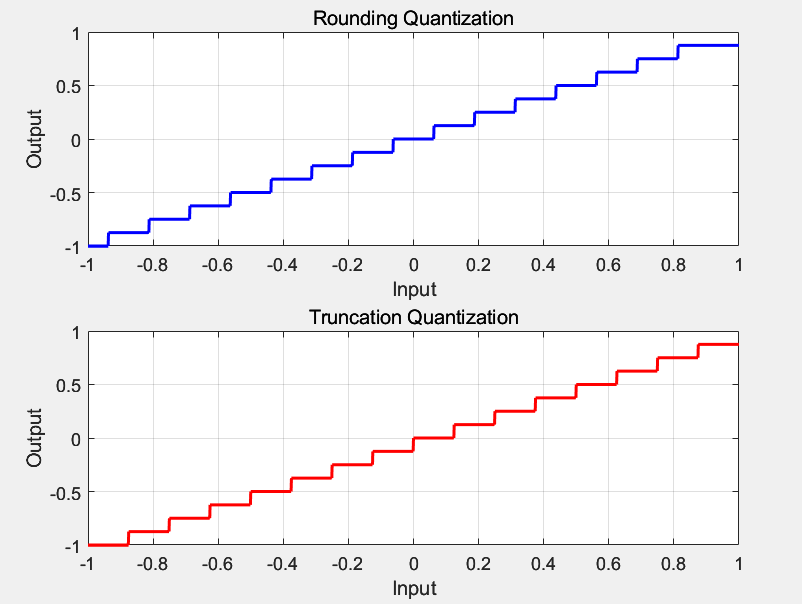
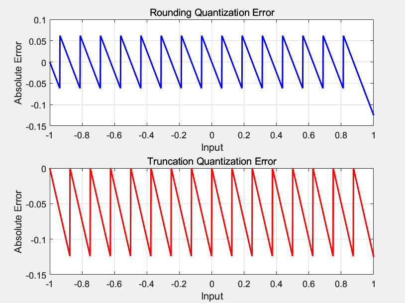
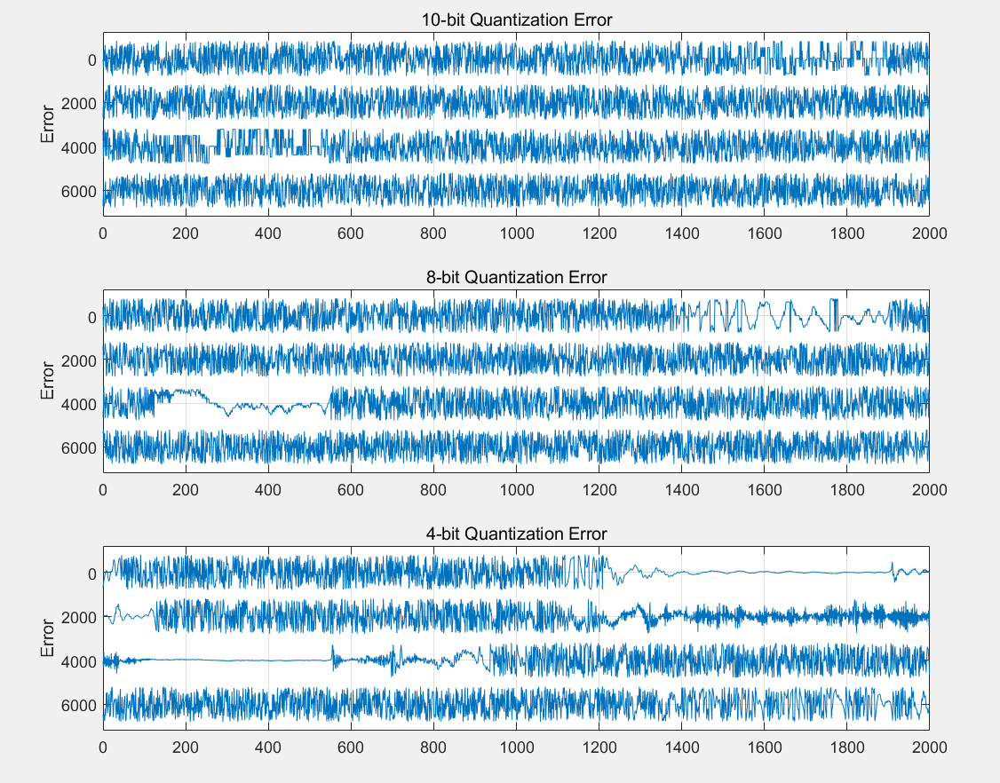
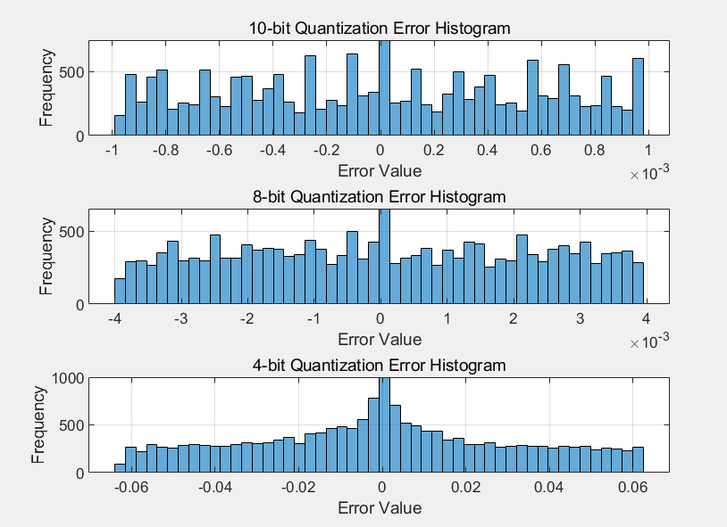
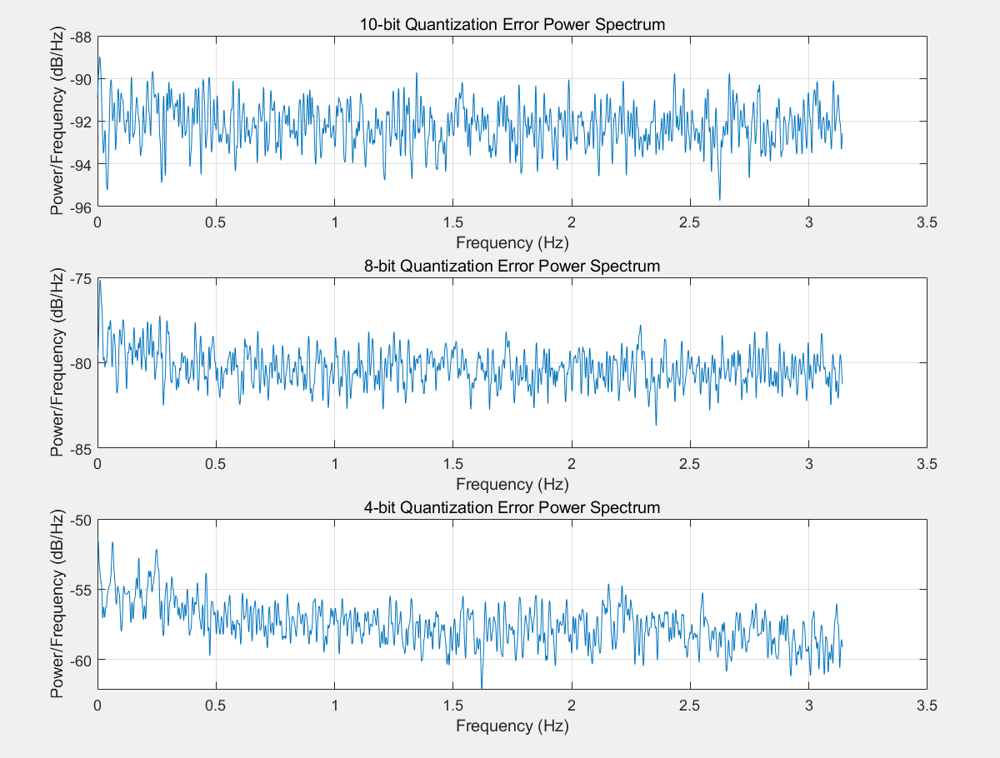
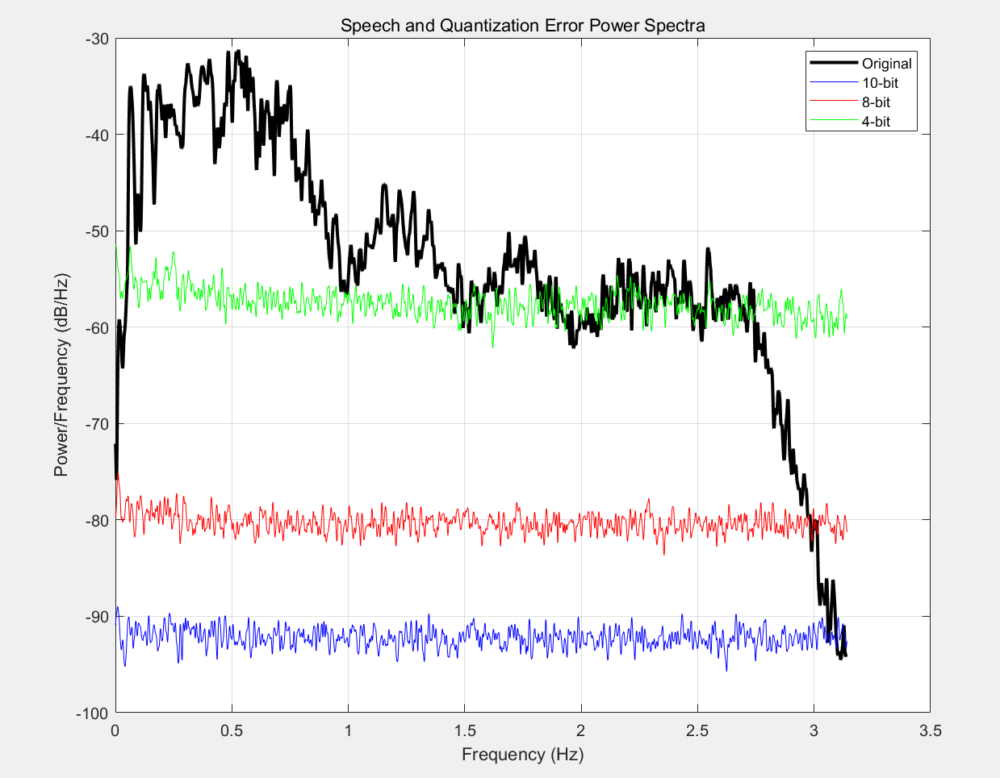

# **Lab9 Report**
### *李梓源     SID:12211225*
### *李沅朔     SID:12210301*

---
## Introduction
This lab course mainly focus on statistical modeling and digital coding. It includes two main tasks: analyzing speech signal statistics and power spectra using concatenated files (out_s1_s6.wav, out_male.wav, out_female.wav) with varying window sizes; and experimenting with uniform quantization using MATLAB's fxquant function to study quantizer characteristics, error sequences, and noise spectra across different bit depths (4-10 bits). Several features can be observed in the simulation result.

---

## Problem 1
### Problem description

1. Concatenate a few given speech file into 'out_s1_s6.wav', 'out_male.wav', 'out_female.wav'.
2. Derive several characteristcs of the concatenated speech file and plot the histogram saperatly.
3. Use MATLAB function `pspect()` to eastimate the long-term average power spectrum of speech with different window length.
4.  Repeat (3) with diffent wav file.

### Solutions and process

1. Speech File Concatenation

Plot all the six wav file and find the beginning and ending of each file. Then use MATLAB function `vertcat()` to concatenate them as described in the probelm

2. Characteristics Extraction

Use MATLAB function `mean`, `var`, `max`, `min` and `histogram` with window length specified. The nfft in the function is set as the same length compared to the window length.

   

### Key code segment

1. The first part is to concatenate the speech file
```matlab
y1_cut = y1(4535:23773);
y2_cut = y2(1071:18700);
y3_cut = y3(3687:end);
y4_cut = y4(3589:21510);
y6_cut = y6(261:16570);
y5_cut = y5(1265:19390);

y1_6 = vertcat(y1_cut, y2_cut, y3_cut, y4_cut, y5_cut, y6_cut);
y_male = vertcat(y2_cut, y4_cut, y4_cut, y5_cut, y6_cut);
y_female = vertcat(y1_cut, y2_cut);

audiowrite('out_s1_s6.wav', y1_6, fs2);
audiowrite('out_male.wav', y_male, fs1);
audiowrite('out_female.wav', y_female, fs1);
```

2. The second part is about featrue extraction
```matlab
[y1, fs1] = audioread('out_s1_s6.wav');
[y2, fs2] = audioread('out_male.wav');
[y3, fs3] = audioread('out_female.wav');
% value config
mean1 = mean(y1)
var1 = var(y1)
max1 = max(y1)
min1 = min(y1)

mean2 = mean(y2)
var2 = var(y2)
max2 = max(y2)
min2 = min(y2)

mean3 = mean(y3)
var3 = var(y3)
max3 = max(y3)
min3 = min(y3)
```

3. The third part is about plotting the histogram and power spectrum
```matlab
% histogram
figure
subplot(221)
histogram(y1, 25), title("out-s1-s6.wav(nbin = 25)")
subplot(222)
histogram(y1, 20), title("out-s1-s6.wav(nbin = 20)")
subplot(223)
histogram(y1, 15), title("out-s1-s6.wav(nbin = 15)")
subplot(224)
histogram(y1, 10), title("out-s1-s6.wav(nbin = 10)")
saveas(gcf, "D:/作业提交/大三 下/语音信号处理/lab9/P1_a_1.png", 'png')

%%% only a few is shown here %%%

% power spectrum
[ps1_1, f1_1] = pspect(y1, fs1, 32, 32);
[ps1_2, f1_2] = pspect(y1, fs1, 64, 64);
[ps1_3, f1_3] = pspect(y1, fs1, 128, 128);
[ps1_4, f1_4] = pspect(y1, fs1, 256, 256);
[ps1_5, f1_5] = pspect(y1, fs1, 512, 512);

figure
plot(f1_1, abs(10*log10(ps1_1)), 'LineWidth', 1), hold on;
plot(f1_2, abs(10*log10(ps1_2)), 'LineWidth', 1), hold on;
plot(f1_3, abs(10*log10(ps1_3)), 'LineWidth', 1), hold on;
plot(f1_4, abs(10*log10(ps1_4)), 'LineWidth', 1), hold on;
plot(f1_5, abs(10*log10(ps1_5)), 'LineWidth', 1), hold off;
xlabel('Frequency (Hz)');
ylabel('Power Spectrum (dB)');
legend('32', '64', '128', '256', '512');
title('Long-term Average Power Spectrum with Different Window Sizes');
grid on;
saveas(gcf, "D:/作业提交/大三 下/语音信号处理/lab9/P1_b.png", 'png')

% test on other wav file
win_len = 32
[p2, f2] = pspect(y2, fs2, win_len, win_len);
[p3, f3] = pspect(y3, fs3, win_len, win_len);
figure
plot(f2, abs(10*log10(p2)), 'LineWidth', 1.5), hold on;
plot(f3, abs(10*log10(p3)), 'LineWidth', 1.5), hold off;
xlabel('Frequency (Hz)');
ylabel('Power Spectrum (dB)');
legend('male', 'female');
title('Long-term Average Power Spectrum with Different Gender')
grid on;
saveas(gcf, "D:/作业提交/大三 下/语音信号处理/lab9/P1_c.png", 'png')
```

### Result and Analysis

1. Question A

| feature | out_s1_s6    | out_male    | out_female         |
|--------|---------------|---------------|---------------|
| mean   | 1.5621e-04    | 1.6033e-04    | 1.4438e-04    |
| var   | 0.0323        | 0.0291        | 0.0273        |
| max | 1.0000        | 1.0000        | 1.0000        |
| min | -1.0000       | -1.0000       | -1.0000       |


As we can see in the result, the distribution of the speech amplitude is generally Gama distribution or Laplace distributon. And the reason why it's a little different compared to the result in the lab PPT is because we cut off the silence part at the beginning and the end.

2. Question B

As we can see in the result, the frequency components mainly concentrates at 500HZ and 4000HZ

3. Question D

Female's spectrum is much lesser compared to male compatriot around 3000HZ, but larger around 3500HZ. This is quite reasonable since female have a higher inotation compared to male.
---

## Problem 2
- **Problem description:** 

  In this problem, we are required to utilize matlab function `X=fxquant(s, bits, rmode, lmode)` to quantize signals using 10, 8 and 4 bits, and compare the influences of different quantization bits and modes on speech signal. Moreover, we will compare the power spectrum of noise sequences, and compare the results to the white noise assumption. 


- **Solution and process**:

1. We will use 4 bits to quantize a slope from -1 to 1 to discuss the influence of truncation and rounding quantization mode. 

2. Next we will apply the quantizing function on speech samples, and compare the quantization error with different numbers of bits for the quantizer. We will then draw histograms of the quantization noise samples, and compare those plots with white noise model. 

3. At last we calculate the spectra of corresponding noise sequences, and compare them with the original unquantized speech samples. 


- **Key code segment:**

1. We will use `xin = -1:0.001:1;` to create the slope, and use different quantizing mode on the slope. The error is calculated by subtracting the quantized signal from the original slope.


```matlab
xin = -1:0.001:1;

X_round = fxquant(xin, 4, 'round', 'sat');
X_trunc = fxquant(xin, 4, 'trunc', 'sat');

e_round_abs = abs(X_round - xin);
e_trunc_abs = abs(X_trunc - xin);

e_round = X_round - xin;
e_trunc = X_trunc - xin;

% Find the range of quantization errors
max_e_round = max(e_round);
min_e_round = min(e_round);
max_e_trunc = max(e_trunc);
min_e_trunc = min(e_trunc);

fprintf('Rounding error range: [%f, %f]\n', min_e_round, max_e_round);
fprintf('Truncation error range: [%f, %f]\n', min_e_trunc, max_e_trunc);

% First figure: Quantization input-output
figure;
subplot(2,1,1);
plot(xin, X_round, 'b-', 'LineWidth', 1.5);
title('Rounding Quantization');
xlabel('Input'); ylabel('Output');
grid on;

subplot(2,1,2);
plot(xin, X_trunc, 'r-', 'LineWidth', 1.5);
title('Truncation Quantization');
xlabel('Input'); ylabel('Output');
grid on;

% Second figure: Quantization errors
figure;
subplot(2,1,1);
plot(xin, e_round, 'b-', 'LineWidth', 1.5);
title('Rounding Quantization Error');
xlabel('Input'); ylabel('Absolute Error');
grid on;

subplot(2,1,2);
plot(xin, e_trunc, 'r-', 'LineWidth', 1.5);
title('Truncation Quantization Error');
xlabel('Input'); ylabel('Absolute Error');
grid on;
```

2. 10 bits, 8 bits and 4 bits are used on the audio signal. We then create figures to draw plots using `strips()` function.

```matlab
[aud, fs] = audioread('s5.wav');

aud = aud(1300:18800);

aud_quant_10bits = fxquant(aud, 10, 'round', 'sat');
aud_quant_8bits = fxquant(aud, 8, 'round', 'sat');
aud_quant_4bits = fxquant(aud, 4, 'round', 'sat');

err_quant_10bits = aud_quant_10bits - aud;
err_quant_8bits = aud_quant_8bits - aud;
err_quant_4bits = aud_quant_4bits - aud;

% Plot the error sequences using strips
figure;
subplot(3,1,1);
strips(err_quant_10bits(1:8000), 2000);
title('10-bit Quantization Error');
ylabel('Error');
grid on;

....

```

Histograms are calculated as below:

```matlab
figure
subplot(3,1,1);
histogram(err_quant_10bits, 50);
title('10-bit Quantization Error Histogram');
xlabel('Error Value'); ylabel('Frequency');
grid on;

....
```

3. The spectra of the quantized signal and orignal samples are calculated using `pspectrum` function as shown below:

```matlab
[err_pxx_10bits, f] = pspectrum(err_quant_10bits);
[err_pxx_8bits, f] = pspectrum(err_quant_8bits);
[err_pxx_4bits, f] = pspectrum(err_quant_4bits);

figure;
subplot(3,1,1);
plot(f, 10*log10(err_pxx_10bits));
title('10-bit Quantization Error Power Spectrum');
xlabel('Frequency (Hz)'); ylabel('Power/Frequency (dB/Hz)');
grid on;

...

[speech_pxx, f] = pspectrum(aud);

figure;
plot(f, 10*log10(speech_pxx), 'k-', 'LineWidth', 2, 'DisplayName', 'Original');
hold on;
plot(f, 10*log10(err_pxx_10bits), 'b-', 'DisplayName', '10-bit');
plot(f, 10*log10(err_pxx_8bits), 'r-', 'DisplayName', '8-bit');
plot(f, 10*log10(err_pxx_4bits), 'g-', 'DisplayName', '4-bit');
title('Speech and Quantization Error Power Spectra');
xlabel('Frequency (Hz)');
ylabel('Power/Frequency (dB/Hz)');
grid on;
legend('show');
hold off;
```


- **Result and Analysis:**
  1. Task 1

<div style="display: flex; gap: 10px;">
  
  
</div>

```
Rounding error range: [-0.125000, 0.062000]
Truncation error range: [-0.125000, 0.000000]
```

The range of truncation error is [-0.125000, 0.000000],  while the randing quantization error is typically [-0.062, 0.062]. The extreme value at input = 1 is caused by overflow.

2. Task 2



The error sequence of 10-bit quantization is mostly like white noise, but there are sections in other two quantized signals that resemble or are completly the same as the original waveform. This is because some values are discarded because original signal is too small or too large (overflow).



Histogram show that the less bits we use to quantize signal, the further away the histogram is to white noise (even distribution).

3. Task 3

<div style="display: flex; gap: 10px; align-items: center;">
  
  
</div>
Three spectra all resemble the spectra of white noise, although 4-bit quantization spectrum have some observable low-frequency components. Also, the noise level of 4-bit quantization error is at the same level as the original signal, signifying observable distortion. 

```
Mean Power in dB for 10-bit: -92.194162
Mean Power in dB for 8-bit: -80.286735
```

The difference of error level is about 12dB for 8 bits and 10 bits.


- Observations


With more bits used in quantization, the quantization error can be reduced, and the overall distribution of quantization noise will more closely resemble that of a white noise. 

With too few bits for quantization, significant distortions will be introduced, including nonlinear distortion, increased quantization noise, and loss of signal fidelity, which can degrade the performance of the system and reduce the accuracy of subsequent processing or analysis.


---

## Conclusion

This lab explored speech signal statistics and quantization effects using different bit depths. Key findings include:

1. Concatenated speech files showed amplitude distributions resembling Gamma or Laplace distributions, with frequency components concentrated between 500Hz and 4000Hz. Female voices exhibited lower spectral values around 3000Hz but higher ones near 3500Hz, aligning with their higher pitch.
2. Increasing the bit depth from 4 to 10 bits significantly reduced quantization errors and made noise distribution more similar to white noise. Conversely, fewer bits led to notable distortions, including increased noise and loss of fidelity, particularly evident in 4-bit quantization where noise levels approached those of the original signal.

In conclusion, selecting an appropriate bit depth is crucial for balancing system performance and data accuracy in practical applications. 
